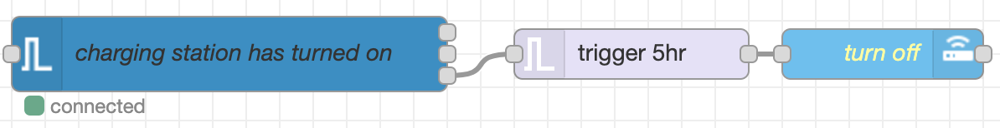
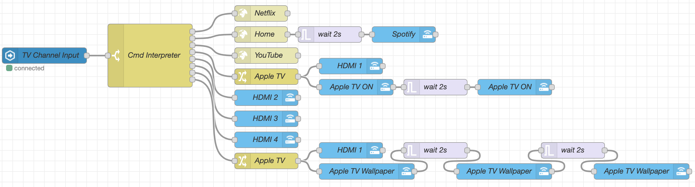

## Universal

### Vacuum the floor when I'm not home
At 10am a check is executed whether the apartment is occupied or not. If it's not occupied the Roomba is triggered to start vacuuming the floor. If the apartment is occupied a notification is sent to me via Telegram to inform me that the cleaning cycle was not started.


??? "Node RED Flow"

    ```python
    [
        {
            "id": "27f43369.1137ec",
            "type": "subflow",
            "name": "apartment occupied?",
            "info": "",
            "category": "",
            "in": [
                {
                    "x": 181.5,
                    "y": 69,
                    "wires": [
                        {
                            "id": "cbbdb47d.a4ed48"
                        }
                    ]
                }
            ],
            "out": [
                {
                    "x": 700,
                    "y": 40,
                    "wires": [
                        {
                            "id": "1792a55d.ddc24b",
                            "port": 0
                        }
                    ]
                },
                {
                    "x": 700,
                    "y": 90,
                    "wires": [
                        {
                            "id": "1792a55d.ddc24b",
                            "port": 1
                        }
                    ]
                }
            ],
            "outputLabels": [
                "clear",
                "occupied"
            ]
        },
        {
            "id": "cbbdb47d.a4ed48",
            "type": "api-current-state",
            "z": "27f43369.1137ec",
            "name": "apartment occupancy",
            "server": "78fe396.483dac8",
            "outputs": 1,
            "halt_if": "",
            "halt_if_type": "str",
            "halt_if_compare": "is",
            "override_topic": true,
            "entity_id": "binary_sensor.apartment_occupancy",
            "state_type": "habool",
            "override_payload": true,
            "override_data": true,
            "x": 361.5,
            "y": 69,
            "wires": [
                [
                    "1792a55d.ddc24b"
                ]
            ]
        },
        {
            "id": "1792a55d.ddc24b",
            "type": "switch",
            "z": "27f43369.1137ec",
            "name": "is occupied?",
            "property": "payload",
            "propertyType": "msg",
            "rules": [
                {
                    "t": "false"
                },
                {
                    "t": "true"
                }
            ],
            "checkall": "true",
            "repair": false,
            "outputs": 2,
            "x": 554.5,
            "y": 69,
            "wires": [
                [],
                []
            ]
        },
        {
            "id": "74556465.5e1fac",
            "type": "api-call-service",
            "z": "d3ff7562.eebf38",
            "name": "Roomba ON",
            "server": "78fe396.483dac8",
            "version": 1,
            "debugenabled": false,
            "service_domain": "vacuum",
            "service": "start",
            "entityId": "vacuum.ghost",
            "data": "",
            "dataType": "json",
            "mergecontext": "",
            "output_location": "payload",
            "output_location_type": "msg",
            "mustacheAltTags": false,
            "x": 570,
            "y": 40,
            "wires": [
                []
            ]
        },
        {
            "id": "d5a40336.045ed",
            "type": "inject",
            "z": "d3ff7562.eebf38",
            "name": "10am weekdays",
            "repeat": "",
            "crontab": "00 10 * * 1,2,3,4,5",
            "once": false,
            "onceDelay": 0.1,
            "topic": "",
            "payload": "true",
            "payloadType": "bool",
            "x": 144.5,
            "y": 60,
            "wires": [
                [
                    "b816139a.b3f9e"
                ]
            ]
        },
        {
            "id": "b816139a.b3f9e",
            "type": "subflow:27f43369.1137ec",
            "z": "d3ff7562.eebf38",
            "name": "",
            "x": 360,
            "y": 60,
            "wires": [
                [
                    "74556465.5e1fac"
                ],
                [
                    "b94a88b0.eff1c8"
                ]
            ]
        },
        {
            "id": "b94a88b0.eff1c8",
            "type": "api-call-service",
            "z": "d3ff7562.eebf38",
            "name": "Telegram Log",
            "server": "78fe396.483dac8",
            "version": "1",
            "debugenabled": false,
            "service_domain": "telegram_bot",
            "service": "send_message",
            "entityId": "",
            "data": "{\"message\":\"Not launching Roomba because someone's home\"}",
            "dataType": "json",
            "mergecontext": "",
            "output_location": "payload",
            "output_location_type": "msg",
            "mustacheAltTags": false,
            "x": 570,
            "y": 80,
            "wires": [
                []
            ]
        },
        {
            "id": "78fe396.483dac8",
            "type": "server",
            "name": "Home Assistant",
            "legacy": false,
            "addon": true,
            "rejectUnauthorizedCerts": true,
            "ha_boolean": "y|yes|true|on|home|open",
            "connectionDelay": true,
            "cacheJson": true
        }
    ]
    ```

## Lights

### Kitchen Overhead Light
If motion is detected at the sink, the kitchen overhead light is turned on. At the same time a timer is set for 3mins. If further motion is detected the timer is reset. If no more motion occurs and the timer runs out the light is turned off again.


### Shelly Light Switches
To prevent the hue lights from being turned off fully I've added a Shelly controller behind each light switch. This detaches the switch from turn on/off the power
and instead sends a MQTT messages to Home Assistant that the button was pressed. So in order for some of the light switches to actually turn on/off lights there
needs to be a really simple automation connecting the action of pressing the switch with some lights that can be controlled.

{: style="width:400px"}

Another advantage of this system is that I've got light switches to spare for other functions. Since for example in the living room I'm happy with turning on/off
all the lights at the same time. So of 4 switches I only need one to control the lights and can use the others e.g. to set a specific scene or turn on the radio.

### Bathroom Light
My bathroom light is dumb, so it's controlled via power on/off of the shelly switch. For that reason and because of some edge cases there's a bit more logic behind this automation..


There's a few requirements behind this automation. The light turns on automatically with motion detection. But I don't want to be blinded a night, since it's a dumb light it can't do dimming, so the light should only turn on during certain times (06:20-22:00 during the week or 08:00-22:00 on a weekend). But if I'm up late it should still turn on automatically, so I've added the condition that if the kitchen light is already on, it's probably fine to turn on the bathroom light as well and not check the time condition.  
But then there was another problem. Since it's a dumb light tube it's a bit slow to turn on. This could result in user error. E.g. the motion detector triggers the light to turn on but the user thinks it didn't work or doesn't know about the motion detector and presses the button. Now the light turns off again and the user wonders why the button didn't work. So to fix this behavior I've added a locking logic that blocks further commands for 2 seconds if the light has been turned on via the button or motion detection.

## Devices

### Washing machine/dryer has finished
If the washing machine or dryer finishes their work a push notification is sent to my phone and Google Home announces that the washer or dryer has finished.
That washing/drying has finished is detected via the power consumption of the respective device with a MyStrom switch. The push notification is sent via the Home Assistant App on my phone. The Google Home announcement uses TTS (text to speech) and Chromecast functionality.


Template sensor to detect if the washing machine is on/off:
```yaml
binary_sensor: 
  - platform: template
    sensors:
        washingmachine_state:
            friendly_name: "Washing Machine State"
            delay_off: # Only switches states after new state existed for x minutes
                minutes: 3
            icon_template: mdi:washing-machine
            value_template: "{{ states.switch.mystrom_washingmachine.attributes.current_power_w | default(0) |float > 10}}"
```

Push Notification
```json
{
    "title": "Washing Machine done 👕",
    "message": "Don't wait for your clothes to wrinkle!"
}
```

### Turn off the charging station
I've set up a charging station for various camera batteries, drone, battery pack etc. To prevent them from being charged constantly I've set up a myStrom switch that is turned off after 5h. So if I plan on going somewhere where I need a fully charged battery in one of these devices I can simply say "Okay Google turn on the charging station" and forget about it. It's quite simple but very convenient.

{: style="width:500px"}

## TV & Entertainment

### iOS TV Remote
iOS has a virtual TV remote in the control center. This remote can be used to control Apple TVs but also Homekit-compatible TVs of other manufacturers. Since my TV doesn't support Homekit natively I wanted to recreate this feature using a [Logitech IR](/hardware/networking/#logitech-harmony-hub) blaster that sends the remote control commands to the TV.

<blockquote class="twitter-tweet"><p lang="en" dir="ltr">Samsung TV playing nice with the native iOS remote utility 😄 - of course using <a href="https://twitter.com/home_assistant?ref_src=twsrc%5Etfw">@home_assistant</a> for the integration. The commands are sent over IR so really any TV could be added like this <a href="https://t.co/tehkkdGzei">pic.twitter.com/tehkkdGzei</a></p>&mdash; Theo Winter (@eletiy) <a href="https://twitter.com/eletiy/status/1281320444931514382?ref_src=twsrc%5Etfw">July 9, 2020</a></blockquote> <script async src="https://platform.twitter.com/widgets.js" charset="utf-8"></script>


So what it does is listen to `homekit_tv_remote_key_pressed` events, check that they're for the correct TV and then map them to the individual IR blaster commands. E.g. `payload.event.key_name = arrow_left` maps to `remote.send_command` with the following payload:

```json
{
    "device": "Samsung TV",
    "command": [
        "DirectionLeft"
    ]
}
```

### TV App Launcher
This one is a bit of a monster. Basically what it allows is to have a Channel selector drop down in the frontend where you can choose the App that should
be launched/switch to on the TV. As an added benefit this also work with Google Home. So I can say stuff like:

+ "Okay Google switch to [**PlayStation**/Apple TV/Netflix/...]"

{: style="width:500px"}

The REST APIs of the TV are shit.. they allow some things but not all - so this is automation is a mixture of REST calls and IR commands. You may be wondering why use the REST APIs at all? Since the TV menu is basically a list of apps, the REST API allows me to jump to a "safe" point in that list. For example I can launch YouTube over the REST Api. I know that I've placed YouTube as the first App, so now I can use IR commands to move 2 positions to the right and for example launch Spotify. If I didn't have the REST command there'd be no way for me to know which App is open at the moment and navigate the menu.



In case you're wondering about the Apple TV Wallpaper path. It's a hacky way to force Apple TV to show the screensaver immediately. The screensaver shows flyovers of major cities all over the world and it's nice to have on as a bit of decoration/art.