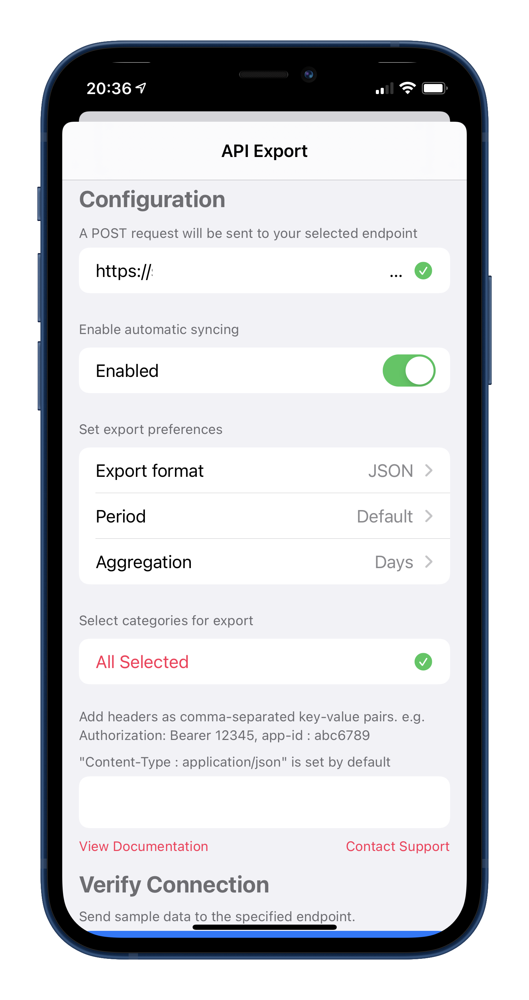
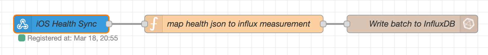
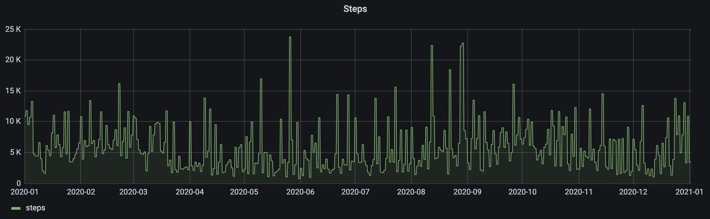

I've recently started using the excellent Influx [addon](/software/home-assistant/#addons) to store data that I want to keep around for a long time. Influx is a time series database which means that it has been optimized to store data through associated pairs of time(s) and value(s). To make use of that data stored in InfluxDB I use a Grafana Dashboard. (Another excellent [addon](/software/home-assistant/#addons) for Home Assistant 😄)

By gathering and analyzing health data you can get some interesting insights about yourself. For example whether there's a correlation between sleep duration and how much your work out. Or if the weather has an effect on your mood. Of course that data could also be used for automations.. e.g. the waking time of the alarm clock is automatically offset by 30min if you went to bed late. With tons of data there's basically no limit to what you can do.

Sadly the Home Assistant app for iOS doesn't have access to Apple Health data and likely never will. This is due to Apple's privacy policy that only allows access to health data for apps that have a specific health focus. This is discussed in [this feature request](https://github.com/home-assistant/iOS/issues/85) for the Home Assistant app.

## There's an app for that

Luckily someone made an app to automatically export Apple Health data to a user defined web endpoint. [You can find it here](https://www.healthexportapp.com/). The data is uploaded in a POST request as JSON. The user can define how many days of data should be uploaded and in what time interval the data should be aggregated.
Personally I'm uploading the data of "yesterday until now" in a daily aggregation format. So for every measurment there's a total value of yesterday and a up-to-now value for today.

{: style="width:300px"}

## Setting up an endpoint

I'm using the webhook node in Node RED to create an endpoint for the POST request of the health export app. The webhook node is really straight forward to use, all you do is set an id for the hook and then you can send data to `https://<ip>:<port>/api/webhook/YOUR_ID`. To test this right away it's best to use a debug node to simply print the json coming in.

The data coming in should look like this.
```json
{
    "data": {
        "metrics": [
            {
                "name": "active_energy",
                "units" "kJ"
                "data": [
                    {
                        "qty": 1599,
                        "date": "2021-03-17 00:00:00 +0100"
                    },
                    {
                        "qty": 1200,
                        "date": "2021-03-16 00:00:00 +0100"
                    }

                ]

            },
            ...
        ],
        "workouts": []
    }
}
```

## Storing the data in InfluxDB
Writing to Influx is fairly simple. I'm using the "[influx batch node](https://flows.nodered.org/node/node-red-contrib-influxdb)" to write all the measurements to InfluxDB in one go. But you could also split them up into seperate messages and use the regular "influx out" node instead.



Of course the InfluxDB Batch node can't consume the data just the way it comes out of the export json.. so we need to do a little bit of mapping before we can forward it. In order to be compatible with other measurments that are written directly from Home Assistant to Influx I'm using the same format. 

This is the content of the function node you can see above. It transforms the json provided by the endpoint into one that can be imported via the batch node.
```javascript
var mappedMetrics = []; 

//e.g. active_energy
msg.payload.data.metrics.forEach(metric => {
    
    //e.g. measurement for 01.01.2020 of active_energy
    metric.data.forEach(actualMeasurement => {
        mappedMetrics.push({
            measurement: metric.units, //kJ
            fields: {
                ...(actualMeasurement.qty !== undefined && {value: actualMeasurement.qty}), //2500 default
                ...(actualMeasurement.Avg !== undefined && {Avg: actualMeasurement.Avg}), //Heartrate special
                ...(actualMeasurement.Max !== undefined && {Max: actualMeasurement.Max}), //Heartrate special
                ...(actualMeasurement.Min !== undefined && {Min: actualMeasurement.Min}), //Heartrate special
                ...(actualMeasurement.inBed !== undefined && {inBed: actualMeasurement.inBed}), //Bed special
                ...(actualMeasurement.asleep !== undefined && {asleep: actualMeasurement.asleep}), //Bed special
                ...(actualMeasurement.sleepSource !== undefined && {sleepSource: actualMeasurement.sleepSource}), //Bed special
                ...(actualMeasurement.inBedSource !== undefined && {inBedSource: actualMeasurement.inBedSource}), //Bed special
            },
            tags:{
                entity_id: metric.name //active_energy
            },
            timestamp: Date.parse(actualMeasurement.date) //2021-03-16 00:00:00 +0100
        });
    })
});

msg.payload = mappedMetrics;
return msg;
```

Finally the batch node itself doesn't have any special settings. Except maybe one, the configuration for the InfluxDB has to be in the "1.x" version format. Since that's the only one where you can specify which db the data should be written to.

If writing to the InfluxDB doesn't work for some reason then error logs should appear in the debug panel of Node RED.

## Historical data

The Node RED flow we've just set up is fully capable of importing historic data as well. So you can use the Manual Sync function of the Health Export app to upload all your existing Apple Health data as well. With a bit of experimentation I've found out that about half a month worth of data can be imported in one go. More then that and the endpoint doesn't seem to be able to handle the request anymore. So you need to do a few requests if you want to upload a years worth of data.. but I think it's not too much of a hassle given that it's a one time thing and all future data is uploaded automatically.


