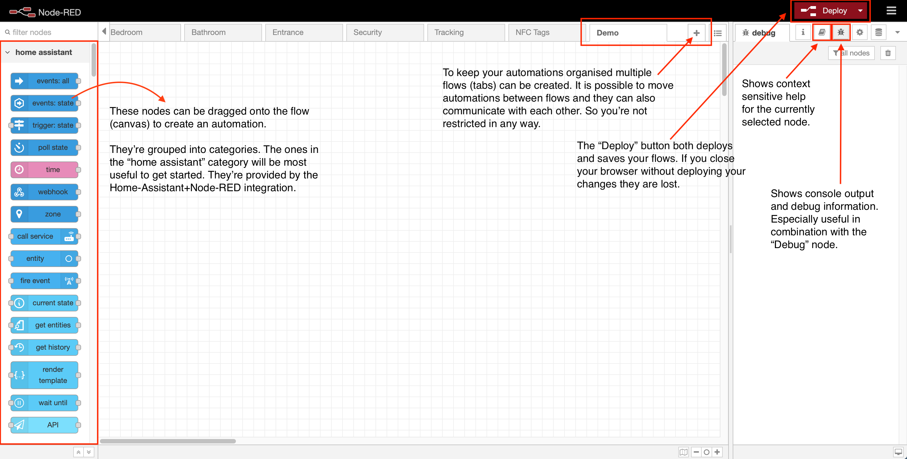
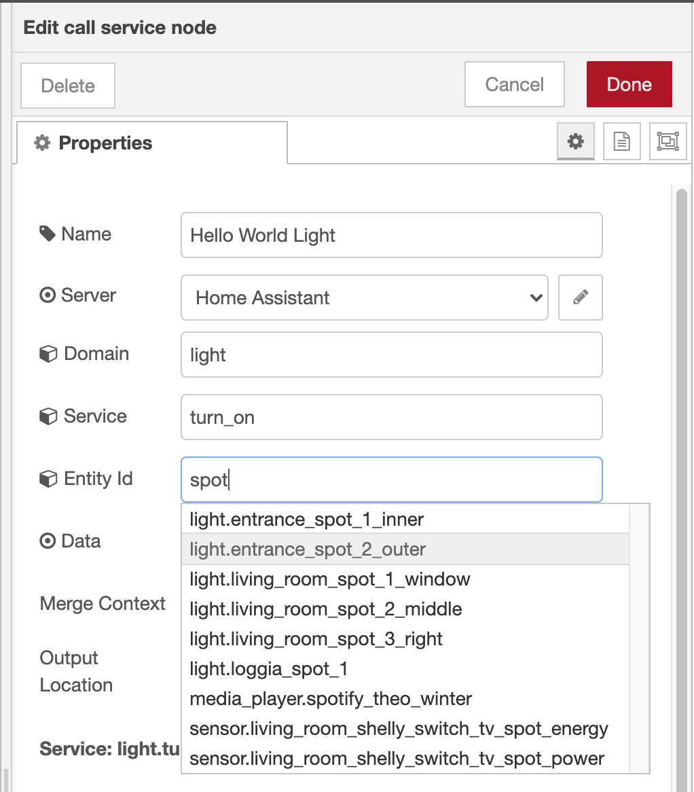
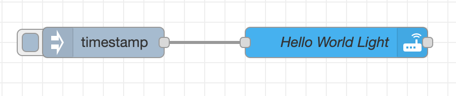
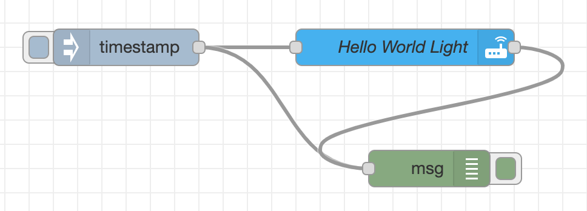
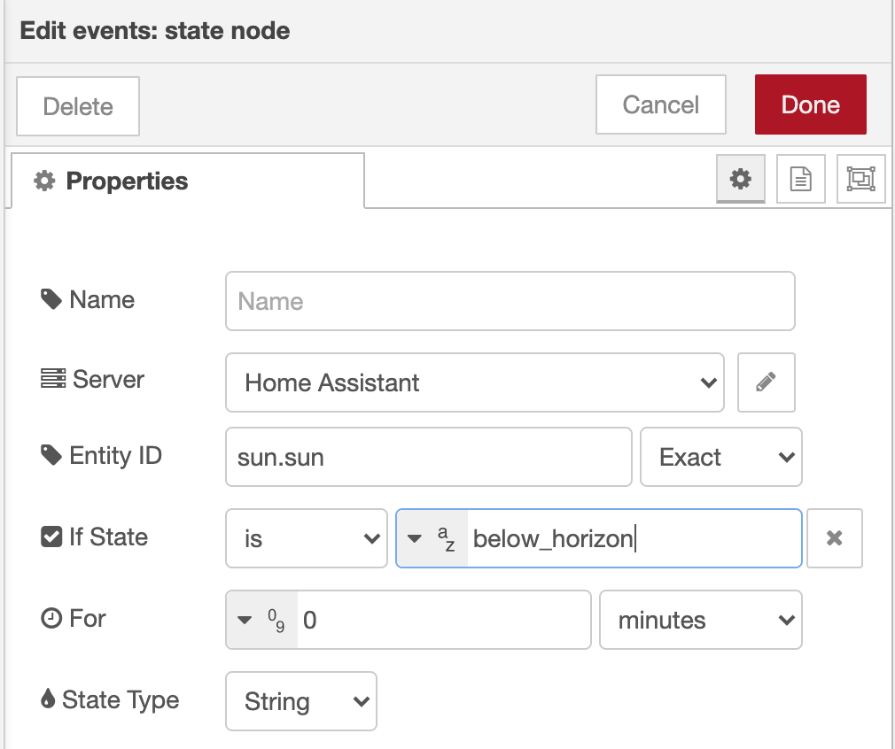

## Installation

The best way to install Node-RED is via the Home Assistant Supervisor. This way you don't have to do any manual configuration to get Home Assistant to talk to Node-RED. It does however require that you're either running the full Home Assistant OS or Home Assistant Supervised on your own OS. If you're only running Home Assistant Core you won't have access to the supervisor.

1. Navigate to Supervisor in the Sidebar of your Home Assistant
2. Select Add-on Store and locate Node-RED under Home Assistant Community Add-ons
3. Install the addon and then go to the configuration tab
4. Set a credential_secret, which is used to encrypt sensitive data
5. Start Node-RED, you can now access it either via the sidebar or the "OPEN WEB UI" button.

## Your first automation

When you're starting Node-RED for the first time you're seeing a UI similar to the screenshot above. On the left side you've got quite a long list of nodes that can be used to create your desired automation. This can be a bit overwhelming a first since you first need to get to know some of the nodes and what you can do with them.

So to get aquainted with some of the nodes we're going to create a little "Hello World" automation. Instead of printing "Hello World" this automation is going to turn on a light at a specific time. If you don't have a light you can substitue it with any other controllable device that you've set up in Home Assistant.

{: align=right style="height:300px"}

### Calling a service
1. To control a light (or another device) we need to use the "call service" node from the Home Assistant category. Drag it onto the flow canvas.
2. Double click the node to open it's configuration panel. You can give it a name, e.g. "Hello World Light". The fields below offer suggestions/autocompletion based on the devices you have configured in Home Assistant.
    3. **Domain**: light
    4. **Service**: turn_on
    5. **Entity id**: start typing the name of a lights Home Assistant id and it should autocomplete
3. Click done to close the node configuration

### Manual testing
Now that we have a node that can turn on a light we need a way to test it. To do this we use a "Inject" node. It's not in the Home Assistant category so you'll need to scroll down to "common" or use the search box in the top left corner.

1. Drag a "Inject" node onto the flow.
2. By default the Inject node injects a timestamp message. This is fine since our service (the light) doesn't need to read the message at this time. It is simply trigged by the incomming message. So we don't need to change the configuration of the inject node and can simple connect the two nodes with a line.
3. Now we're ready for our first deployment. Press the **deploy** button.

    {: style="width:400px"}

4. After deploying the flow you can click on the small grey square in front of the Inject node to manually trigger it. Your chosen light should now turn on.

### Debugging

If you want to see what a message sent between nodes looks like you can use the "Debug" node to inspect them. In order to do this you'll need to search for the Debug node in the nodes panel.

1. Drag a "Debug" node onto the flow.
2. Double-click the node to bring up the configuration panel.
3. In the **Output** dropdown select "complete msg object". This will let you see the whole message instead of just the payload. Click done to close the panel.
4. Attach the node to any place you want to inspect.

    {: style="width:400px"}

5. Deploy the flow and trigger the inject node again.
6. If you switch to the debug panel (little bug icon, top right corner) you can now see the two messages that have been received by the debug node. In this case they should look identical since the "Call service" node doesn't change the message. But you can see how this is useful if we're sending more complex messages.

### But wait, this isn't an automation...

Right, so far we've been pressing the inject button manually. But maybe we want to light to turn on automatically in the evening. This can be accomplished easily by changing the configuration of the inject node to be triggered at a certain time.

1. Double-click the Inject node to bring up the configuration
2. In the **Repeat** dropdown at the bottom choose "at a specific time".
3. Now you can select a time & days when a message should be injected. If you need a more complex schedule there are other nodes that can for example accept a CRON statement.

### Using sensor input

Of course we can also use a sensors as input to turn on our light. To do this we use a "events: state" node from the Home Assistant node panel.

{: align=right style="height:300px"}

1. Drag a "events: state" node onto the flow.
2. Doubleclick the node to open it's configuration panel
3. *Entity id:** Start typing the id of a sensor you have configured in Home Assistant, it should autocomplete. For this example we can use "sun.sun" which is a virtual sensor provided by Home Assistant. It reports the state of the sun "above_horizon", "below_horizon" based on your configured location.
4. We could listen to any state change, but we want to turn on the light only when the sun has set. So we're going to type "below_horizon" into the **If state is** field.
5. Finally we need to connect our new node to the Light node and deploy.
6. In order to test this, you'll need to wait for sunset.. :) or change the sensor to something else, e.g. a motion sensor. But don't forget to change or remove the state condition if you do use something other than the sun.

This concludes my little intro to writing automations in Node-RED, obviously a lot more can be done. But with a bit of experimentation and these few basic nodes a lot of automations are already possible.

## Most useful nodes

This is a small list of the nodes that I use in 90% of my automations. Occasionally another special node is useful, but these cover most cases.

| Node | Icon | Category | Description | Example |
|------|------|----------|-------------|---------|
|call service|tbd| home assistant |Sends a request to home assistant for any domain and service available| Turn on a light|
|event: state |tbd| home assistant |Outputs state_changed event types sent from Home Assistant| Motion sensor detected motion, light was turned on, sun has risen|
|Debug |tbd| common | Displays selected message properties in the debug sidebar tab | |
|Inject |tbd| common | Injects a message into a flow either manually or at regular intervals | Inject message at 20:00 on Wednesdays|
|Link in/out |tbd| common | Create virtual wires between flows. | Connect nodes across flows or reduce messy cabling in flows with lots of connections |
|Switch |tbd| function | Route messages based on their property values or sequence position. Basically an if statement | if temperature > 24 turn off heating, otherwise turn on|
|Function |tbd| function | A JavaScript function to run against the messages being received by the node | Manipulate a message with javascript, e.g. combine sensors values, round numbers etc.|