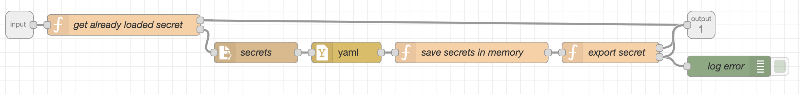

Node-RED knows a concept called subflows that can be used to create flows that can be re-used easily. Think of it as helper methods.
Here are a few that I've found useful when building more complex automations.

## Home Assistant Secrets

With this subflow you can access the secrets.yaml file that contains your Home Assistant secrets (api keys, passwords etc.) from Node-RED.
The subflow accept a `secret_id` as input and returns the loaded secret as `msg.secret` attribute in the output message.
Depending on your setup you may need to edit the location of the secret.yaml file in the `secrets` node.



??? "Get Home Assistant Secret Flow - Copy & Paste into Node-RED > Import"

    ```python
    [
        {
            "id": "d4379195.7e131",
            "type": "subflow",
            "name": "get secret",
            "info": "",
            "category": "",
            "in": [
                {
                    "x": 40,
                    "y": 40,
                    "wires": [
                        {
                            "id": "358bbb81.f1b0c4"
                        }
                    ]
                }
            ],
            "out": [
                {
                    "x": 1020,
                    "y": 40,
                    "wires": [
                        {
                            "id": "358bbb81.f1b0c4",
                            "port": 0
                        },
                        {
                            "id": "cb9383d4.07e1a",
                            "port": 0
                        },
                        {
                            "id": "cb9383d4.07e1a",
                            "port": 1
                        }
                    ]
                }
            ],
            "env": [
                {
                    "name": "secret_id",
                    "type": "str",
                    "value": "",
                    "ui": {
                        "icon": "font-awesome/fa-lock",
                        "type": "input",
                        "opts": {
                            "types": [
                                "str"
                            ]
                        }
                    }
                }
            ],
            "color": "#3FADB5",
            "icon": "font-awesome/fa-lock"
        },
        {
            "id": "cbb350e7.54a96",
            "type": "file in",
            "z": "d4379195.7e131",
            "name": "secrets",
            "filename": "/config/secrets.yaml",
            "format": "utf8",
            "chunk": false,
            "sendError": false,
            "encoding": "none",
            "x": 380,
            "y": 80,
            "wires": [
                [
                    "168da1d3.7b3ace"
                ]
            ]
        },
        {
            "id": "168da1d3.7b3ace",
            "type": "yaml",
            "z": "d4379195.7e131",
            "property": "payload",
            "name": "",
            "x": 510,
            "y": 80,
            "wires": [
                [
                    "cd100a20.901b08"
                ]
            ]
        },
        {
            "id": "cd100a20.901b08",
            "type": "function",
            "z": "d4379195.7e131",
            "name": "save secrets in memory",
            "func": "for (let [key, value] of Object.entries(msg.payload)) {\n  flow.set(key,value);\n}\nreturn msg;",
            "outputs": 1,
            "noerr": 0,
            "initialize": "",
            "finalize": "",
            "x": 690,
            "y": 80,
            "wires": [
                [
                    "cb9383d4.07e1a"
                ]
            ]
        },
        {
            "id": "358bbb81.f1b0c4",
            "type": "function",
            "z": "d4379195.7e131",
            "name": "get already loaded secret",
            "func": "msg.secret_id = env.get(\"secret_id\");\nmsg.secret = flow.get(msg.secret_id);\n\nif (msg.secret !== undefined && msg.secret !== null) {\n    return [ msg, null ];\n} else {\n    msg.payload_backup = msg.payload;\n    return [ null, msg ];\n}",
            "outputs": 2,
            "noerr": 0,
            "initialize": "",
            "finalize": "",
            "x": 190,
            "y": 40,
            "wires": [
                [],
                [
                    "cbb350e7.54a96"
                ]
            ],
            "outputLabels": [
                "secret was loaded",
                "secret is not loaded yet"
            ]
        },
        {
            "id": "cb9383d4.07e1a",
            "type": "function",
            "z": "d4379195.7e131",
            "name": "export secret",
            "func": "msg.secret = flow.get(msg.secret_id);\nmsg.payload = msg.payload_backup;\ndelete msg.payload_backup;\ndelete msg.filename;\n\nif (msg.secret !== undefined && msg.secret !== null) {\n   return [ msg, null ];\n} else {\n    msg.error = \"SECRET DOES NOT EXIST!\"\n   return [ null, msg ];\n}",
            "outputs": 2,
            "noerr": 0,
            "initialize": "",
            "finalize": "",
            "x": 890,
            "y": 80,
            "wires": [
                [],
                [
                    "9020c683.c61c98"
                ]
            ],
            "outputLabels": [
                "secret was loaded",
                "secret does not exist"
            ]
        },
        {
            "id": "9020c683.c61c98",
            "type": "debug",
            "z": "d4379195.7e131",
            "name": "log error",
            "active": true,
            "tosidebar": true,
            "console": false,
            "tostatus": false,
            "complete": "true",
            "targetType": "full",
            "statusVal": "",
            "statusType": "auto",
            "x": 1060,
            "y": 100,
            "wires": []
        },
        {
            "id": "e8afbb97.2bf848",
            "type": "subflow:d4379195.7e131",
            "z": "84cddc8f.78464",
            "name": "",
            "x": 450,
            "y": 900,
            "wires": [
                []
            ]
        }
    ]
    ```