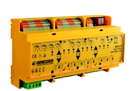

#### KNX Controller 9x Aktor MGX-9
The KNX blinds controller is pre-installed in the apartment. One thing I learned about KNX is that you can't download an existing configuration of a controller. You can just overwrite it. This has led to some issues where the building couldn't control the blinds anymore once I wrote my own configuration onto the controller. Luckily I was able to get the source files for the original configuration from a technician and add my own KNX addresses to it. So now the building can still lock my blinds for maintenance or high winds but I can also control them via Home Assistant. KNX devices are configured with [ETS](https://www.knx.org/knx-en/for-professionals/software/ets-5-professional/index.php) which is available for free for personal use (up to 5 devices).

{: style="height:150px"}

#### KNX IP Interface 731
This device is a interface between the KNX TP (twisted pair) and ethernet. It allows Home Assistant to communicate with the KNX controller controlling the blinds in my apartment. It fits in a DIN-bracket and draws power directly from the KNX bus.

{: style="height:150px"}