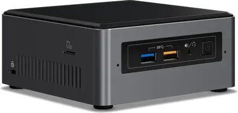

### Intel NUC Baby Canyon NUC7i3BNH
The brains of my whole Smart Home setup. It's sporting a Intel i3-7100U CPU clocking 2.4 GHz, 2x 8GB DDR-4 Ram and an Intel 545 256GB SSD.
As for software it's running Ubuntu 18.04 LTS, Docker and most importantly Home Assistant. I'm currently running Home Assistant as a supervised installation (HA Core + Supervisor).

{: style="height:150px"}

### Raspberry PI Zero
Just a Raspberry Pi Zero running a headless Raspbian image. I use it as a BLE to MQTT gateway for the Xiaomi Flower Care sensors in my loggia. When triggered it will poll all the Flower Care sensors and forward their values over MQTT.