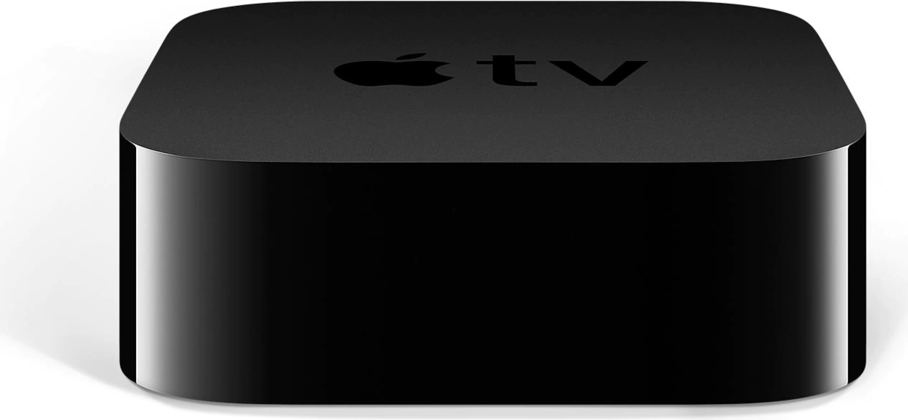

#### Samsung QE65Q7F
A smart tv. It connects to the internet over Ethernet or WiFi. It has some Web APIs but they're quite restricted and not fully finished.. e.g. you can switch between tv mode and the first hdmi source but not others.. so I've ended up automating it over IR commands sent via a Logitech Harmony Hub. Other then the bad API it's a good tv. It has apps for all the major streaming providers and it can also play 4k video from a computer or network share.

{: style="height:150px"}

#### Sony PS4 Pro
A game console. It can be controlled by Home Assistant via ethernet/WiFi.

{: style="height:150px"}

#### Apple TV 4K 32GB
I originally bought this as a way to expose Apple Homekit for remote access. However I've since stopped using Homekit almost entirely. It's still useful for casting photos & videos from an iOS device and to watch IPTV from Init7.

{: style="height:100px"}

#### Nvidia Shield TV
I originally bought this because I thought Android TV was cool. I rarely use it. It serves as a Chromecast occasionally.. but that's really all there is to it.

{: style="height:100px"}