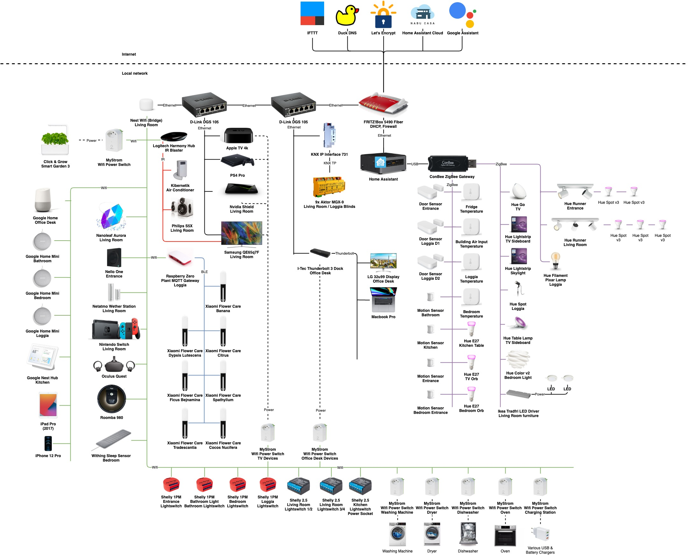

# Hardware

These are all the smart devices I'm currently using. They're grouped into rough categories which you can see on the left.

Below you can see a simplified diagram of how everything works together. The differently colored lines signify different modes of communication, such as wifi, ethernet, ZigBee and so on.

