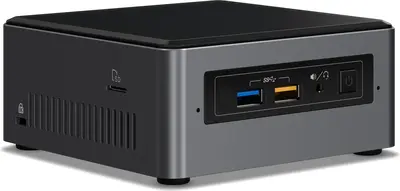
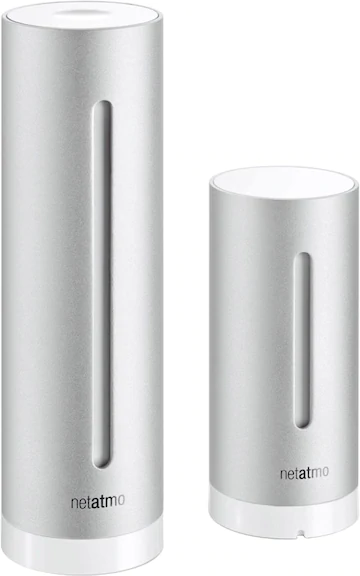
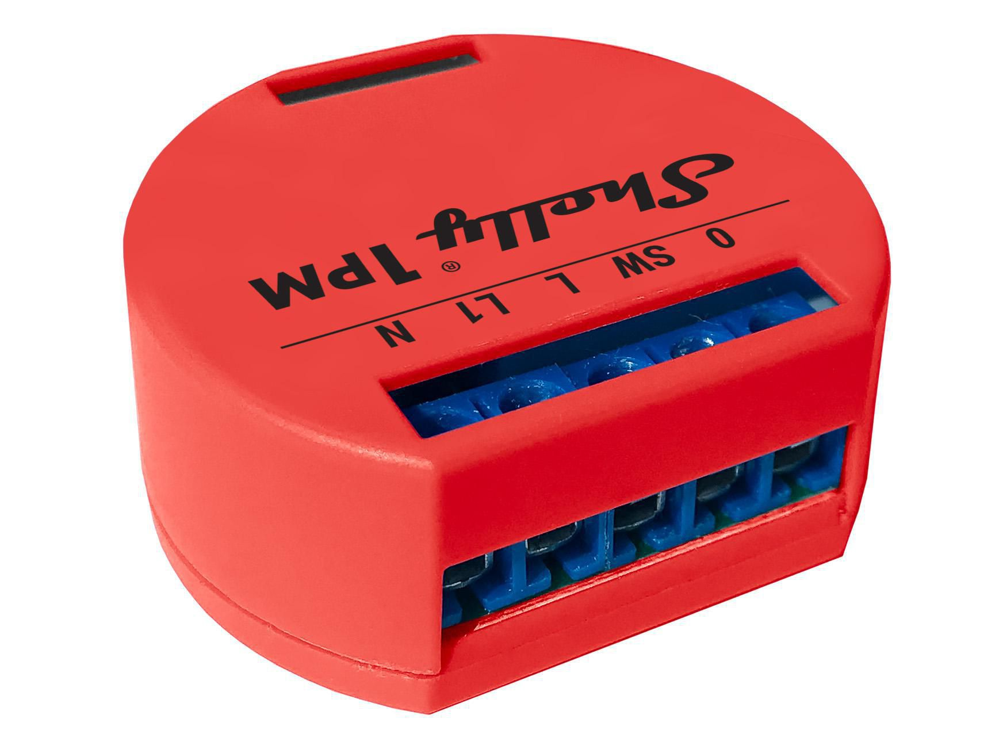
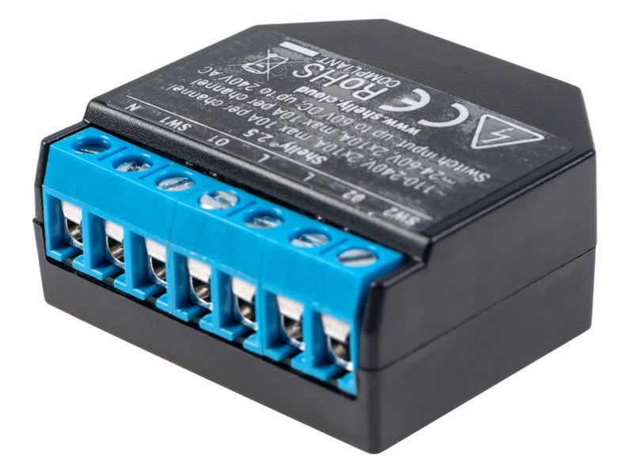
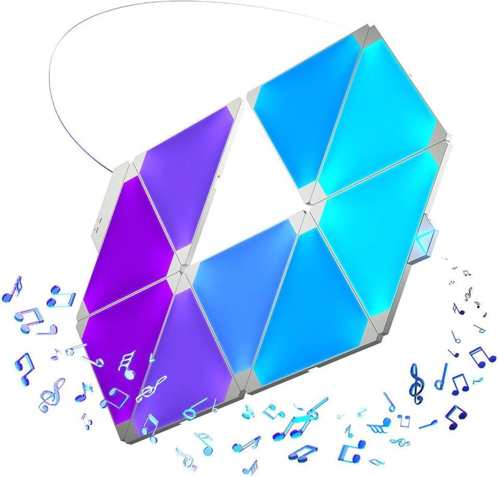
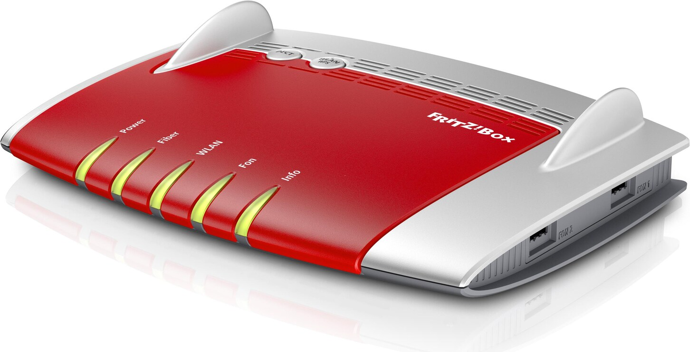
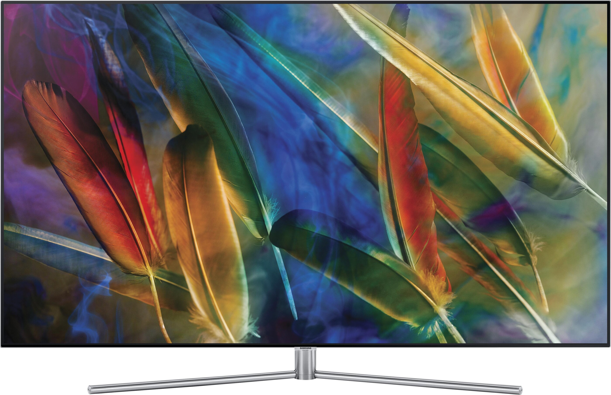
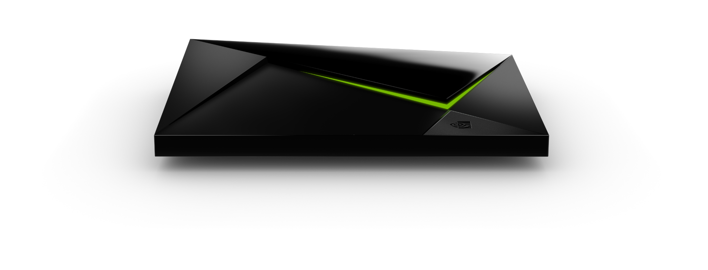
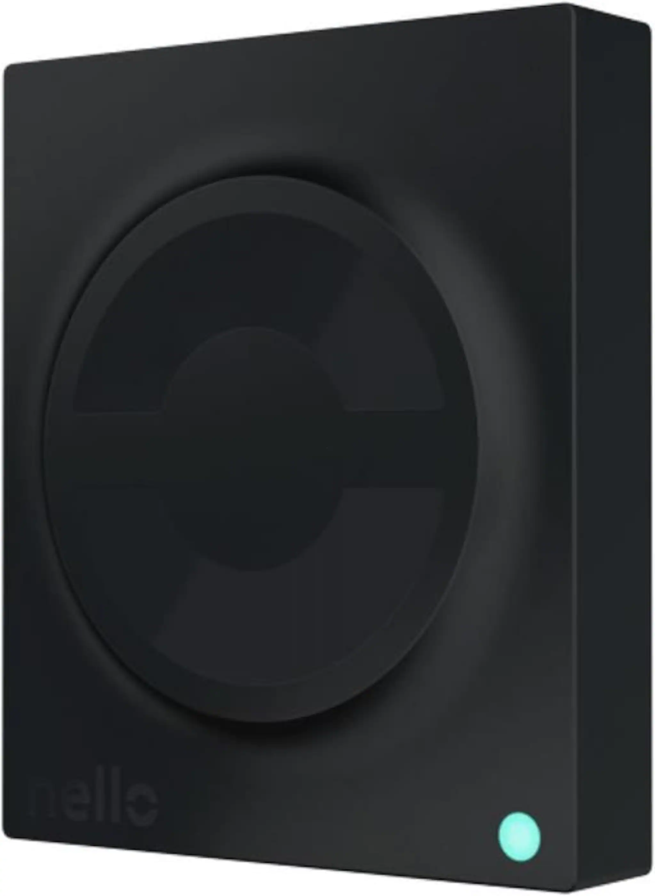
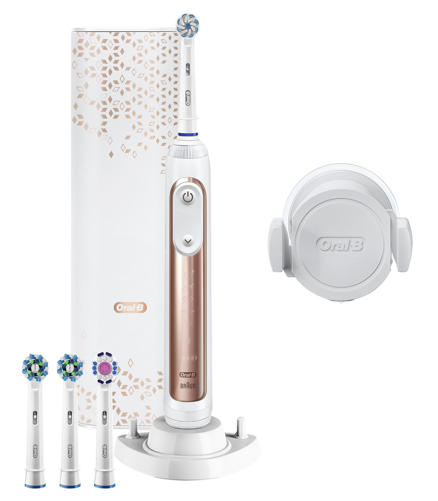

A list of the hardware currently present in my smart home.

## Computers

### Intel NUC Baby Canyon NUC7i3BNH
The brains of my whole Smart Home setup. It's sporting a Intel i3-7100U CPU clocking 2.4 GHz, 2x 8GB DDR-4 Ram and an Intel 545 256GB SSD.
As for software it's running Ubuntu 18.04 LTS, Docker and most importantly Home Assistant.

{: style="height:150px"}

### Raspberry PI Zero
Just a Raspberry Pi Zero running a headless Raspbian image. I use it as a BLE to MQTT gateway for the Xiaomi Flower Care sensors in my loggia. When triggered it will poll all the Flower Care sensors and forward their values over MQTT.

## Sensors

### Xiaomi
I have a lot of Xiaomi sensors. They're all paired to the Dresden Elektronik ConBee ZigBee stick

| Name                     | Description                        | Sensors                                      | Communication |
|--------------------------|------------------------------------|----------------------------------------------|---------------|
| Aqara Shock Sensor       | Detects movement                   | Vibration, Temperature                       | ZigBee        |
| Aqara Temperature Sensor | Reports temperature, humidity etc. | Temperature, Humidity, Atmospheric Pressure  | ZigBee        |
| Xiaomi Flower Care       | Reports soil status.               | Water level, temperature, fertilizer         | BLE           |
| Aqara Door Sensor        | Detects door open/closed           | open/close                                   | ZigBee        |

### Philips Hue

### Withings Sleep
It's main purpose is to record my sleep patterns and store them in Apple Health. However as an added benefit I can use it detect when the bed is occupied and e.g. automatically turn off lights.

{: style="height:150px"}

#### Netatmo Weatherstation
One of the first devices I bought for my smart home. It consists of a indoor and outdoor weather station. Sadly the outdoor one has died after a few years.. but the indoor one is still going strong. Apart from the temperature it also reports the Carbon Dioxide levels which none of my other sensors do.

{: style="height:150px"}

## Power Switches

### Shelly
Shelly's are tiny power switches that I've placed behind the actual light switches of my apartment. I mainly use them to detach the event of clicking a light-switch and turning the power of the light bulbs on/off. Since I use smart light bulbs (Philips Hue), the light bulbs need to be powered on all the time, otherwise they can't be controlled via Home Assistant, Google Home etc. This is where the Shellys come in real handy. They connect to Home Assistant via MQTT over WiFi and they can be configured in a way that pressing the actual light switch will simply send an MQTT event but not actually turn of the power of the light bulbs. Home Assistant can then decide what to do with the button press event. In some cases I turn on/off the lights, but in other cases I've re-used the light switch to do other things. Such as change light scene or turn on the radio.

#### Shelly 1PM
This shelly switches on power line / button. It also measure the power consumed.

{: style="height:150px"}

#### Shelly 1PM
This shelly switches two power lines / buttons. It also measures the power consumed. It could also be used to control electric blinds, but I don't use it for that.

{: style="height:150px"}

### MyStrom Switch
I have a bunch of MyStrom smart switches connected to all sorts of devices. I use them to control the connected devices, but also for automations. For example I use two of them to measure the power consumption of the washer & dryer. That data is then used to send a notification when the washer or dryer has finished and it's time to take out the clothes.

{: style="height:200px"}

## Voice Assistants & Smart Display

### Google Home
I use Google Home to have voice controls for all my devices and as a digital assistant. Devices relevant for voice controls are exposed to Google Assistant via the Nabu Casa integration.
In my apartment I've deployed 5 Google Home devices to reach 100% coverage of voice recognition in all rooms. In addition to voice control they also serve as smart speakers for playing music or notifications.

Some of the commands I use most often:

Okay Google ...

+ \[**open**/close\] the blinds
+ turn \[**all**/the bedroom/the living room\] lights \[**on**/off\]
+ play \[**music**/radio\] \[**...**/on everywhere\]
+ add \[item\] to the shopping list
+ what's the temperature \[**inside**/outside\]?
+ turn off the tv

| Device | Description | Count |
|------------------|-----------------------------------------------------------------------------------------------------------------------------------------------------------------------------------------------------------------------------------------------------------------------------------|-------|
| Google Home | The original Google Home. Has pretty good sound quality from multiple speakers. I have one placed near the computer desk and I use it to listen to music. | 1         |
| Google Home Mini | This a small version of a Google Home, it has only one speaker.  I have one in the bathroom, bedroom and loggia. They're decent enough to listen to music ocasionally. | 3                             |
| Google Nest Hub | This one is also a smart display. It can show receipts, timers, maps, youtube videos and more. I have one in the kitchen, it's ideal for cooking. Also nice to see the weather forecast for the whole week. It has a touch screen but I operate it only by voice 95% of the time. | 1         |

## Lights

### Philips Hue
I use mostly Philips Hue lightbulbs.

- Philips Filament

#### Nanoleaf Aurora
A smart light consisting of triangle shaped LED panels. The panels can be arranged in any pattern desired. It can also be animated with or without music. The Nanoleaf connects to Home Assistant over WiFi.

{: style="height:150px"}

## Wireless Network Hubs

### Infrared

#### Logitech Harmony Hub
Used to control TV, external speakers and air conditioner.

{: style="height:50px"}

### ZigBee

#### Dresden Elektronik ConBee Stick
I use a Dresden Elektronik ConBee stick as ZigBee gateway for most of my ZigBee devices. I'd like to use it exclusively, however I've been having some trouble with the new Bluetooth-enabled Philips Hue bulbs. So those few new gen Philips Hue bulbs are connected to a normal Hue Hub. The ConBee stick is plugged directly into the Intel Nuc running Home Assistant.

{: style="height:50px"}

#### Philips Hue Hub v2
I use this hub only to connect to newer Philips Hue bulbs that don't yet work with the ConBee ZigBee stick. I'd prefer to not use this hub because it is only connected to Home Assistant via Polling, this makes it slower then the ZigBee stick. It also doesn't support the Xiaomi ZigBee sensors and those sensors benefit from having powered devices nearby. So I try to have all ZigBee devices in the mesh connected to the Dresden Elektronik ConBee Stick.

### WiFi & Ethernet

#### FRITZ!Box 5490
The router recommended by my internet provider (Init 7). This is the fiber version. It works very well and I'm quite happy. It's easy to set static IPs in the local network and port forwarding works well. I don't use the WiFi feature.

{: style="height:150px"}

#### D-Link DGS-105

#### Google Wifi
I use this only because it's made by Google and looks quite nice.

{: style="height:150px"}

## TV & Entertainment

#### Samsung QE65Q7F
A smart tv. It connects to the internet over Ethernet or WiFi. It has some Web APIs but they're quite restricted and not fully finished.. e.g. you can switch between tv mode and the first hdmi source but not others.. so I've ended up automating it over IR commands sent via a Logitech Harmony Hub. Other then the bad API it's a good tv. It has apps for all the major streaming providers and it can also play 4k video from a computer or network share.

{: style="height:150px"}

#### Sony PS4 Pro
A game console. It can be controlled by Home Assistant via ethernet/WiFi.

{: style="height:150px"}

#### Apple TV 4K 32GB
I originally bought this as a way to expose Apple Homekit for remote access. However I've since stopped using Homekit almost entirely. It still sees occasional use a airplay display. 

{: style="height:100px"}

#### Nvidia Shield TV
I originally bought this because I thought Android TV was cool. I rarely use it. It serves as a Chromecast occasionally.. but that's really all there is to it.

{: style="height:100px"}

## Locks

#### Nello One
The Nello One is a interesting device. It's installed as a middle man between the buildings intercom/door opener system. It allows me to open the apartment buildings main door from my phone instead of with a key. The way it does this is by emulating a button press (door open) on the intercom device.

{: style="height:100px"}

## NFC

### NFC Tags

## Blinds

#### KNX Controller

#### KNX IP Bridge

## Other Smart Devices

#### Kibernetik Air Conditioner
A simple AC device. Communicates over IR.

{: style="height:150px"}

#### iRobot Roomba 980
Smart vacuum robot that communicates over WiFi. It's actually running Linux and you can connect to it via SSH. Pretty dope, no? :D

{: style="height:150px"}

#### Oral-B Elektro Genius 10100S
Smart toothbrush that communicates over BLE.

{: style="height:150px"}