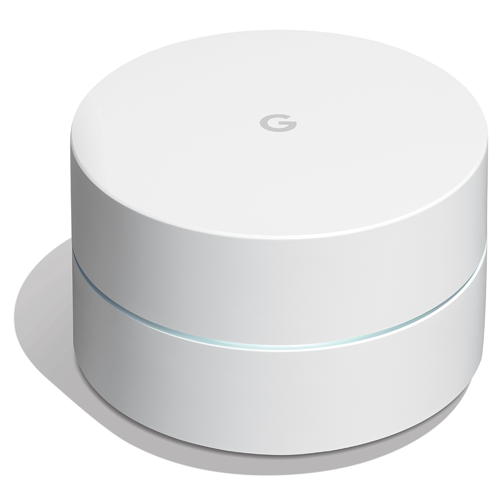

A list of the hardware currently present in my smart home.

## Computers

### Intel NUC Baby Canyon NUC7i3BNH
The brains of my whole Smart Home setup. It's sporting a Intel i3-7100U CPU clocking 2.4 GHz, 2x 8GB DDR-4 Ram and an Intel 545 256GB SSD.
As for software it's running Ubuntu 18.04 LTS, Docker and most importantly Home Assistant. I'm currently running Home Assistant as a supervised installation (HA Core + Supervisor).

{: style="height:150px"}

### Raspberry PI Zero
Just a Raspberry Pi Zero running a headless Raspbian image. I use it as a BLE to MQTT gateway for the Xiaomi Flower Care sensors in my loggia. When triggered it will poll all the Flower Care sensors and forward their values over MQTT.

## Sensors

### Xiaomi
I have a lot of Xiaomi sensors. They're all paired to the Dresden Elektronik ConBee ZigBee stick. Xiaomi products are best bought on AliExpress although swiss retailers such as Galaxus now have them as well for a steep markup. The ZigBee sensors use the nearest cable-powered device to access the mesh network, so that the least bit of energy is needed. In my experience the battery life of their coin-cells last around 1-2years even for frequently used devices such as door sensors. The battery life is however a bit reduced if the sensor is exposed to the cold. My outside temperature sensor typically only lasts a few months. It probably also needs more energy since the signal has to pass through thick walls/insulated windows.

The Xiaomi Flower Care sensors use BLE to report their values. Although Home Assistant provides a direct integration I cannot use it since my Home Assistant computer is too far away from where I've placed the sensors. So I'm using a Raspberry Pi Zero to collect the sensor values via BLE and then send them on the Home Assistant over MQTT.

| Name                     | Description                        | Sensors                                      | Communication |
|--------------------------|------------------------------------|----------------------------------------------|---------------|
| [Aqara Vibration Sensor](https://www.aqara.com/us/vibration_sensor.html)       | Detects movement                   | Vibration, Temperature                       | ZigBee        |
| [Aqara Temperature Sensor](https://www.aqara.com/us/temperature_humidity_sensor.html) | Reports temperature, humidity etc. | Temperature, Humidity, Atmospheric Pressure  | ZigBee        |
| [Xiaomi Flower Care](https://www.amazon.de/-/en/Xiaomi-Flower-Smart-Sensor-Monitor/dp/B074TY93JM)       | Reports soil status.               | Water level, temperature, fertilizer         | BLE           |
| [Aqara Door Sensor](https://www.aqara.com/us/door_and_window_sensor.html)        | Detects door open/closed           | open/close                                   | ZigBee        |

### Withings Sleep
It's main purpose is to record my sleep patterns and store them in Apple Health. However as an added benefit I can use it detect when the bed is occupied and e.g. automatically turn off lights.

{: style="height:150px"}

#### Netatmo Weatherstation
One of the first devices I bought for my smart home. It consists of a indoor and outdoor weather station. Sadly the outdoor one has died after a few years.. but the indoor one is still going strong. Apart from the temperature it also reports the Carbon Dioxide levels which none of my other sensors do.

{: style="height:150px"}

## Power Switches

### Shelly
Shelly's are tiny power switches that I've placed behind the actual light switches of my apartment. I mainly use them to detach the event of clicking a light-switch and turning the power of the light bulbs on/off. Since I use smart light bulbs (Philips Hue), the light bulbs need to be powered on all the time, otherwise they can't be controlled via Home Assistant, Google Home etc. This is where the Shellys come in real handy. They connect to Home Assistant via MQTT over WiFi and they can be configured in a way that pressing the actual light switch will simply send an MQTT event but not actually turn of the power of the light bulbs. Home Assistant can then decide what to do with the button press event. In some cases I turn on/off the lights, but in other cases I've re-used the light switch to do other things. Such as change light scene or turn on the radio.

#### Shelly 1PM
This shelly switches on power line / button. It also measure the power consumed.

{: style="height:150px"}

#### Shelly 2.5
This shelly switches two power lines / buttons. It also measures the power consumed. It could also be used to control electric blinds, but I don't use it for that.

{: style="height:150px"}

### MyStrom Switch
I have a bunch of MyStrom smart switches connected to all sorts of devices. I use them to control the connected devices, but also for automations. For example I use two of them to measure the power consumption of the washer & dryer. That data is then used to send a notification when the washer or dryer has finished and it's time to take out the clothes.

{: style="height:200px"}

## Voice Assistants & Smart Display

### Google Home
I use Google Home to have voice controls for all my devices and as a digital assistant. Devices relevant for voice controls are exposed to Google Assistant via the Nabu Casa integration.
In my apartment I've deployed 5 Google Home devices to reach 100% coverage of voice recognition in all rooms. In addition to voice control they also serve as smart speakers for playing music or notifications.

Some of the commands I use most often:

Okay Google ...

+ \[**open**/close\] the blinds
+ turn \[**all**/the bedroom/the living room\] lights \[**on**/off\]
+ play \[**music**/radio\] \[**...**/on everywhere\]
+ add \[item\] to the shopping list
+ what's the temperature \[**inside**/outside\]?
+ turn off the tv

| Device | Description | Count |
|------------------|-----------------------------------------------------------------------------------------------------------------------------------------------------------------------------------------------------------------------------------------------------------------------------------|-------|
| Google Home | The original Google Home. Has pretty good sound quality from multiple speakers. I have one placed near the computer desk and I use it to listen to music. | 1         |
| Google Home Mini | This a small version of a Google Home, it has only one speaker.  I have one in the bathroom, bedroom and loggia. They're decent enough to listen to music ocasionally. | 3                             |
| Google Nest Hub | This one is also a smart display. It can show receipts, timers, maps, youtube videos and more. I have one in the kitchen, it's ideal for cooking. Also nice to see the weather forecast for the whole week. It has a touch screen but I operate it only by voice 95% of the time. | 1         |

## Lights

### Philips Hue
I use mostly Philips Hue light bulbs. They work well and are easily paired.

- Philips Hue Filament BT
- Philips Hue GU10 Spot Color BT
- Philips Hue E26 Color

#### Nanoleaf Aurora
A smart light consisting of triangle shaped LED panels. The panels can be arranged in any pattern desired. It can also be animated with or without music. The Nanoleaf connects to Home Assistant over WiFi.

{: style="height:150px"}

## Wireless Network Hubs

### Infrared

#### Logitech Harmony Hub
Logitech Harmony Hub is a infrared broadcast device that is accessed over wifi. It can be directly integrated into Home Assistant. From Home Assistant infrared codes can be sent to control various devices. In my setup I use it to control the TV, speakers and in summer the AC machine.

{: style="height:50px"}

### ZigBee

#### Dresden Elektronik ConBee Stick
I use a Dresden Elektronik ConBee stick as ZigBee gateway for all of my ZigBee devices. The ConBee is a USB stick that's plugged directly into the Intel Nuc running Home Assistant. In Home Assistant I'm using the deCONZ addon for adding and configuring ZigBee devices.

{: style="height:50px"}

### WiFi & Ethernet

#### FRITZ!Box 5490
I'm using the Fritz!Box 5490 as router and DHCP server. This is the fiber version. It works well and it's easy to configure & manage static IPs which is something you have to do often in a well organized Smart Home setup. I'm not using the wifi-router functionality because it's not located ideally for spreading the wifi signal. I'm also not using any of Fritz!'s smart home features.

{: style="height:150px"}

#### Google Nest Wifi
I use a single Google Nest Wifi as my access point. It provides fast wireless access at gigabit speeds and has various optimizations for multi-device access as well as future compatibility to BLE and Thread for smart home device integrations. Additionally it looks nice and can be placed openly which improves the spread of the wifi signal as well. I run my Nest Wifi in bridge mode, which means it's DHCP server functionality is disabled and it simply extends my LAN over wifi.

!!! warning
    Beware that Google Nest Wifi does not support mesh networking in bridge mode. So if you're using a Fritz!Box or similar router for managing statics IPs you cannot run a Google Nest Wifi mesh network. This is a bit of a downside, so I would not recommend using this wifi router if you're planning to run a mesh network.

{: style="height:150px"}

## TV & Entertainment

#### Samsung QE65Q7F
A smart tv. It connects to the internet over Ethernet or WiFi. It has some Web APIs but they're quite restricted and not fully finished.. e.g. you can switch between tv mode and the first hdmi source but not others.. so I've ended up automating it over IR commands sent via a Logitech Harmony Hub. Other then the bad API it's a good tv. It has apps for all the major streaming providers and it can also play 4k video from a computer or network share.

{: style="height:150px"}

#### Sony PS4 Pro
A game console. It can be controlled by Home Assistant via ethernet/WiFi.

{: style="height:150px"}

#### Apple TV 4K 32GB
I originally bought this as a way to expose Apple Homekit for remote access. However I've since stopped using Homekit almost entirely. It's still useful for casting photos & videos from an iOS device and to watch IPTV from Init7.

{: style="height:100px"}

#### Nvidia Shield TV
I originally bought this because I thought Android TV was cool. I rarely use it. It serves as a Chromecast occasionally.. but that's really all there is to it.

{: style="height:100px"}

## Locks

#### Nello One
The Nello One is a interesting device. It's installed as a middle man between the buildings intercom/door opener system. It allows me to open the apartment buildings main door from my phone instead of with a key. The way it does this is by emulating a button press (door open) on the intercom device.

{: style="height:100px"}

## NFC

### Home Assistant Tag Reader
I'm using a [Home Assistant Tag reader](https://github.com/adonno/tagreader) to read various NFC tags. For example I have NFC cards for various light scenes that aren't used that frequently (e.g. party scene). I also plan on using this for Spotify playlists and other things that aren't so easily exposed in the physical world.

## Blinds

#### KNX Controller 9x Aktor MGX-9
The KNX blinds controller is pre-installed in the apartment. One thing I learned about KNX is that you can't download an existing configuration of a controller. You can just overwrite it. This has led to some issues where the building couldn't control the blinds anymore once I wrote my own configuration onto the controller. Luckily I was able to get the source files for the original configuration from a technician and add my own KNX addresses to it. So now the building can still lock my blinds for maintenance or high winds but I can also control them via Home Assistant. KNX devices are configured with [ETS](https://www.knx.org/knx-en/for-professionals/software/ets-5-professional/index.php) which is available for free for personal use (up to 5 devices).

{: style="height:150px"}

#### KNX IP Interface 731
This device is a interface between the KNX TP (twisted pair) and ethernet. It allows Home Assistant to communicate with the KNX controller controlling the blinds in my apartment. It fits in a DIN-bracket and draws power directly from the KNX bus.

{: style="height:150px"}

## Other Smart Devices

#### Kibernetik Air Conditioner
A simple AC device. Can be controlled over infrared. I use the Logitech Harmony Hub to do this.

{: style="height:150px"}

#### iRobot Roomba 980
Smart vacuum robot that communicates over WiFi. It's actually running Linux and you can connect to it over SSH. I'm happy with it's cleaning capabilities. The vacuum is started from a schedule in Home Assistant but only when Home Assistant sees that I'm not home.

{: style="height:150px"}

#### Oral-B Elektro Genius 10100S
Smart toothbrush that communicates over BLE. I haven't integrated this yet.. but it's on the list ;-)

{: style="height:150px"}