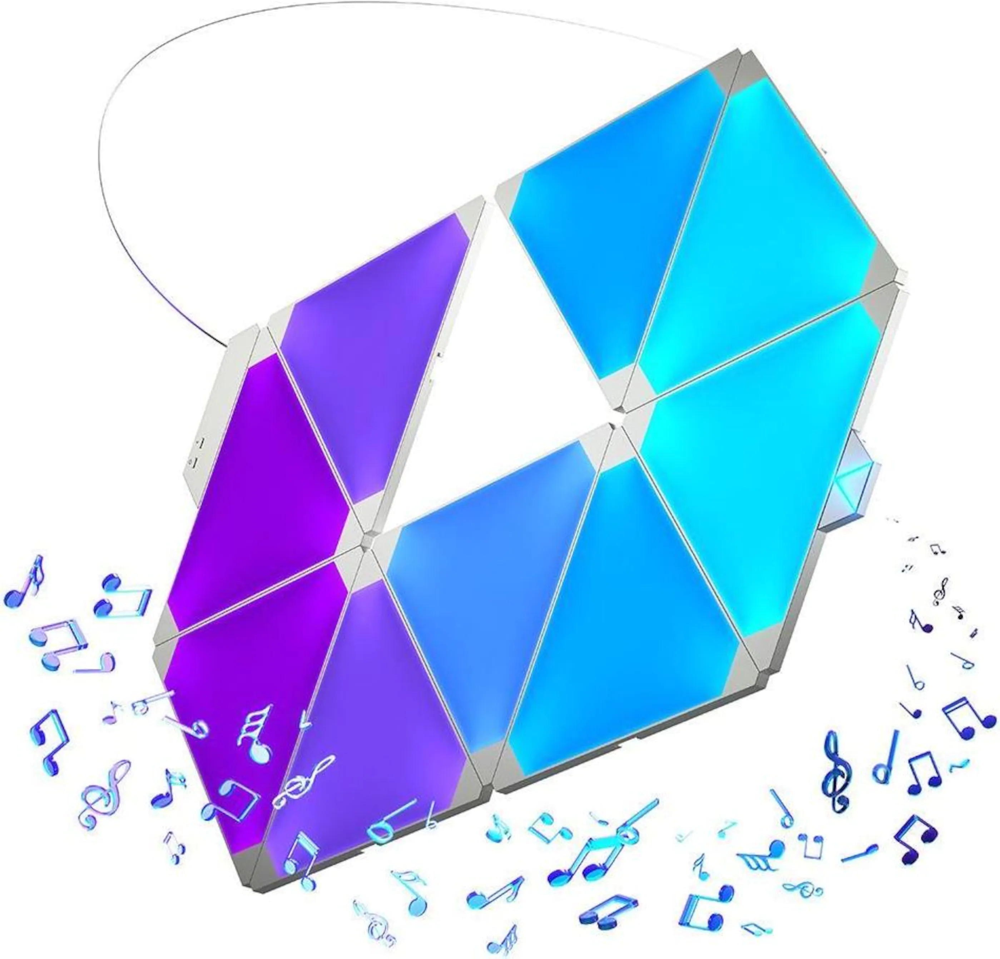

### Philips Hue
I use mostly Philips Hue light bulbs. They work well and are easily paired.

- Philips Hue Filament BT
- Philips Hue GU10 Spot Color BT
- Philips Hue E26 Color

### Nanoleaf Aurora
A smart light consisting of triangle shaped LED panels. The panels can be arranged in any pattern desired. It can also be animated with or without music. The Nanoleaf connects to Home Assistant over WiFi.

{: style="height:150px"}