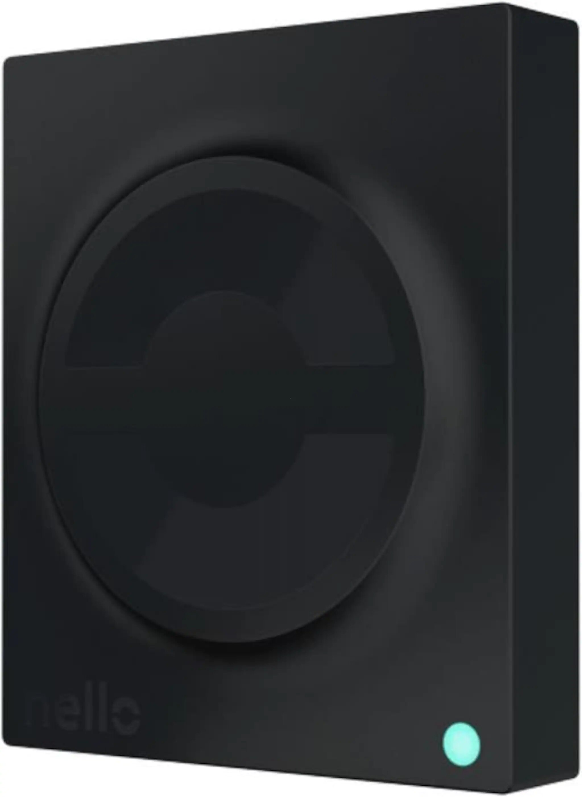

#### Nello One
The Nello One is a interesting device. It's installed as a middle man between the buildings intercom/door opener system. It allows me to open the apartment buildings main door from my phone instead of with a key. The way it does this is by emulating a button press (door open) on the intercom device.

{: style="height:100px"}