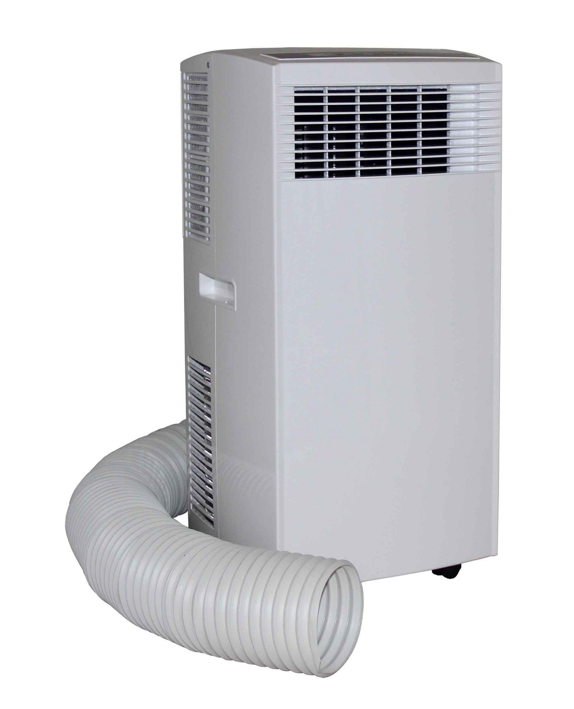
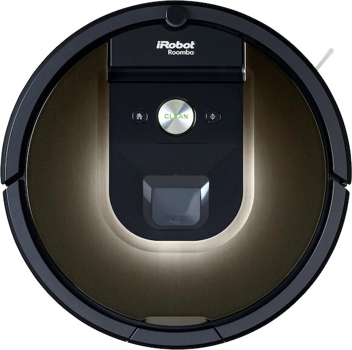

#### Kibernetik Air Conditioner
A simple AC device. Can be controlled over infrared. I use the Logitech Harmony Hub to do this.

{: style="height:150px"}

#### iRobot Roomba 980
Smart vacuum robot that communicates over WiFi. It's actually running Linux and you can connect to it over SSH. I'm happy with it's cleaning capabilities. The vacuum is started from a schedule in Home Assistant but only when Home Assistant sees that I'm not home.

{: style="height:150px"}

#### Oral-B Elektro Genius 10100S
Smart toothbrush that communicates over BLE. I haven't integrated this yet.. but it's on the list ;-)

{: style="height:150px"}