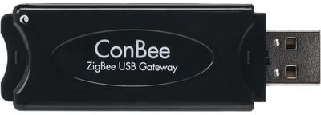
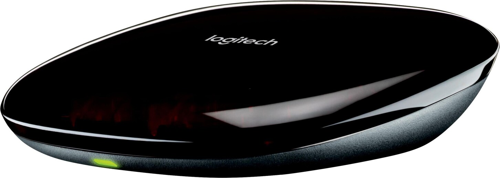
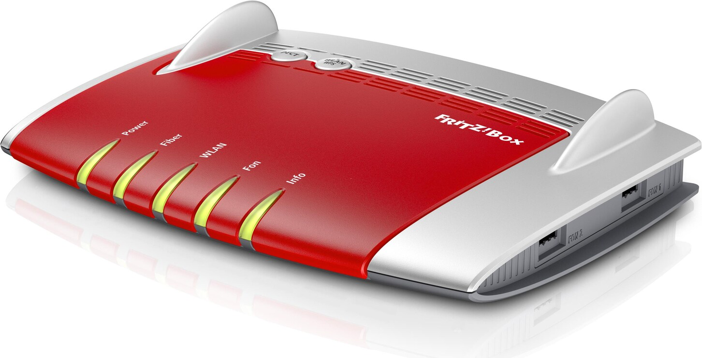
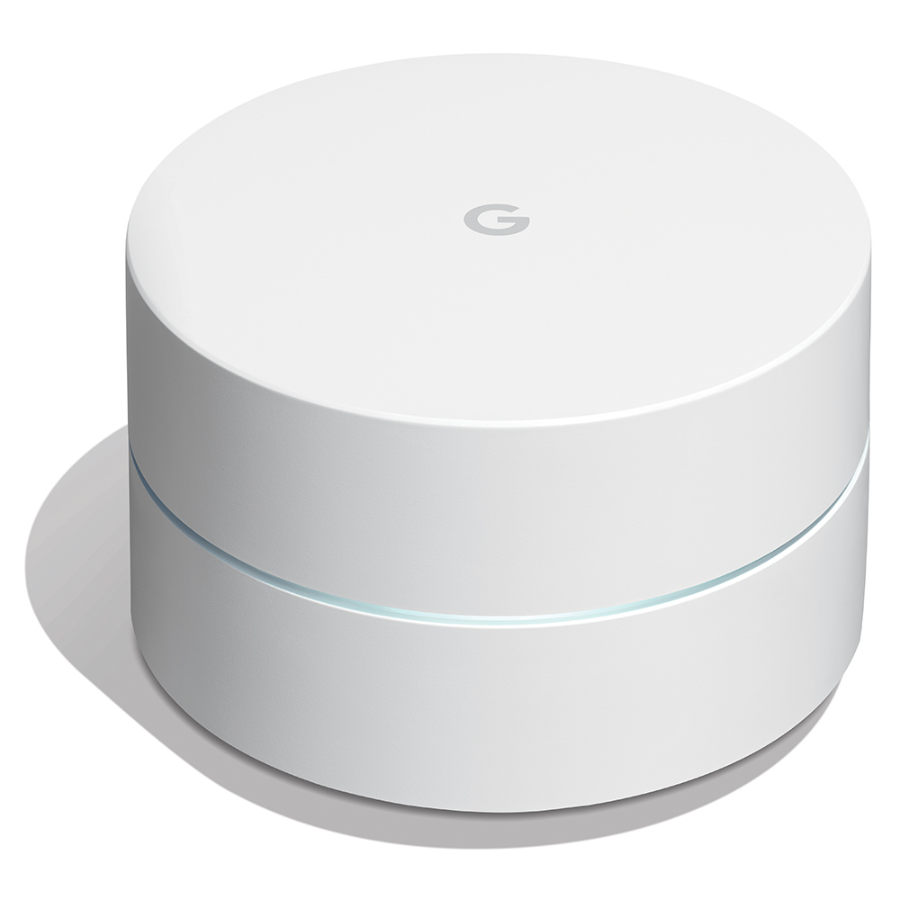

## ZigBee

### Dresden Elektronik ConBee Stick
I use a Dresden Elektronik ConBee stick as ZigBee gateway for all of my ZigBee devices. The ConBee is a USB stick that's plugged directly into the Intel NUC running Home Assistant. In Home Assistant I'm using the [deCONZ addon](/software/home-assistant/#addons) for adding and configuring ZigBee devices. The main advantage of using a ConBee instead of e.g. the Philips Hue hub is that you can unite devices of different vendors in a single Zigbee mesh. This is important because it grows a single large network instead of multiple small ones. Especially small sensors that are powered by button cells profit enormously from having access to close-by mains powered device such as a hue light.

The ConBee stick works entirely locally and does not need a cloud service of it's vendor. This makes it more robust against outages and you don't have to worry as much about an additional attack vector or privacy. This is really a good product that I can recommend without hesitation. You can find more details on it's [manufacturer website](https://phoscon.de/en/conbee2/).

{: style="height:50px"}

## Infrared

### Logitech Harmony Hub
Logitech Harmony Hub is a infrared broadcast device that is accessed over wifi. It can be directly integrated into Home Assistant. From Home Assistant infrared codes can be sent to control various devices. In my setup I use it to control the TV, speakers and in summer the AC machine.

{: style="height:50px"}

## WiFi & Ethernet

### FRITZ!Box 5490
I'm using the Fritz!Box 5490 as router and DHCP server. This is the fiber version. It works well and it's easy to configure & manage static IPs which is something you have to do often in a well organized Smart Home setup. I'm not using the wifi-router functionality because it's not located ideally for spreading the wifi signal. I'm also not using any of Fritz!'s smart home features.

{: style="height:150px"}

### Google Nest Wifi
I use a single Google Nest Wifi as my access point. It provides fast wireless access at gigabit speeds and has various optimizations for multi-device access as well as future compatibility to BLE and Thread for smart home device integrations. Additionally it looks nice and can be placed openly which improves the spread of the wifi signal as well. I run my Nest Wifi in bridge mode, which means it's DHCP server functionality is disabled and it simply extends my LAN over wifi.

!!! warning
    Beware that Google Nest Wifi does not support mesh networking in bridge mode. So if you're using a Fritz!Box or similar router for managing statics IPs you cannot run a Google Nest Wifi mesh network. This is a bit of a downside, so I would not recommend using this wifi router if you're planning to run a mesh network.

{: style="height:150px"}