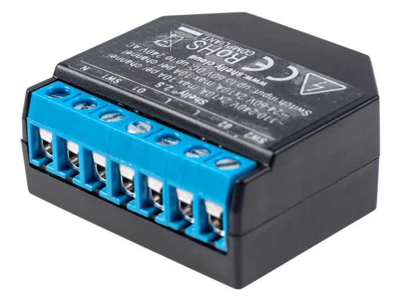

### Shelly
Shelly's are tiny power switches that I've placed behind the actual light switches of my apartment. I mainly use them to detach the event of clicking a light-switch and turning the power of the light bulbs on/off. Since I use smart light bulbs (Philips Hue), the light bulbs need to be powered on all the time, otherwise they can't be controlled via Home Assistant, Google Home etc. This is where the Shellys come in real handy. They connect to Home Assistant via MQTT over WiFi and they can be configured in a way that pressing the actual light switch will simply send an MQTT event but not actually turn of the power of the light bulbs. Home Assistant can then decide what to do with the button press event. In some cases I turn on/off the lights, but in other cases I've re-used the light switch to do other things. Such as change light scene or turn on the radio.

#### Shelly 1PM
This shelly switches on power line / button. It also measure the power consumed.

{: style="height:150px"}

#### Shelly 2.5
This shelly switches two power lines / buttons. It also measures the power consumed. It could also be used to control electric blinds, but I don't use it for that.

{: style="height:150px"}

### MyStrom Switch
I have a bunch of MyStrom smart switches connected to all sorts of devices. I use them to control the connected devices, but also for automations. For example I use two of them to measure the power consumption of the washer & dryer. That data is then used to send a notification when the washer or dryer has finished and it's time to take out the clothes.

{: style="height:200px"}