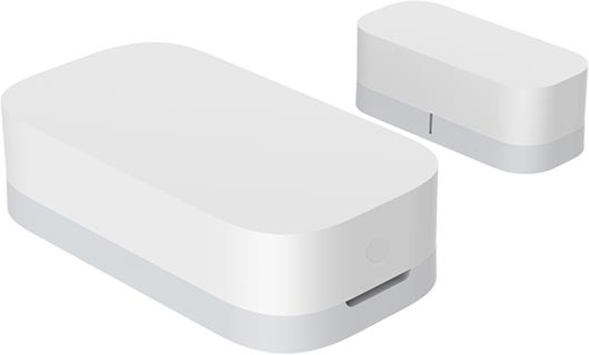
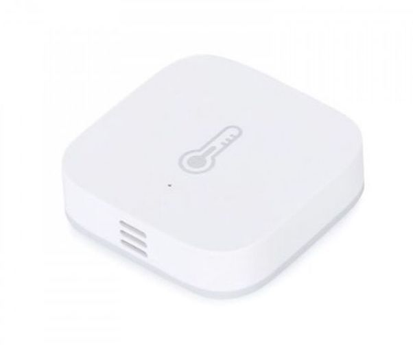
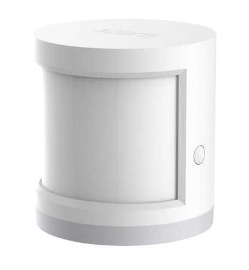
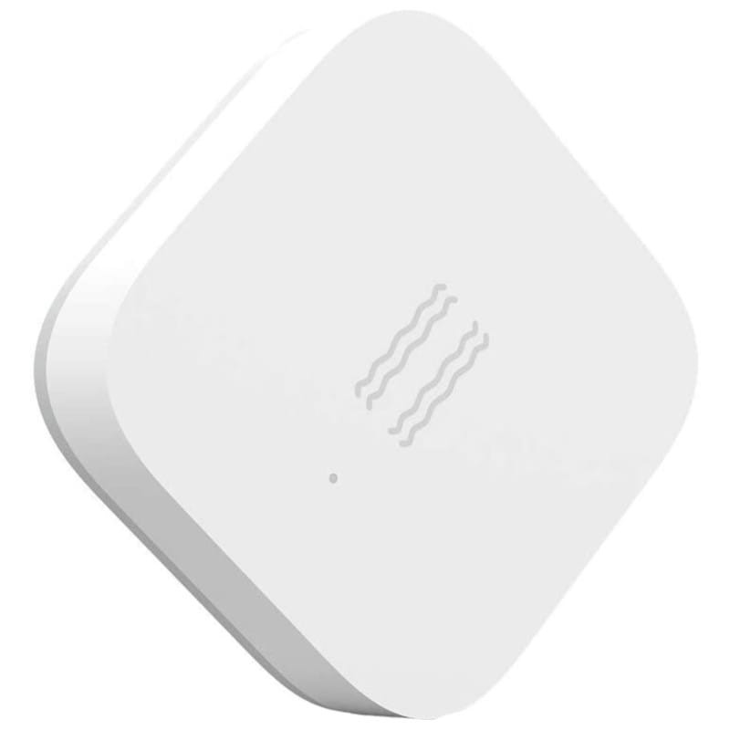
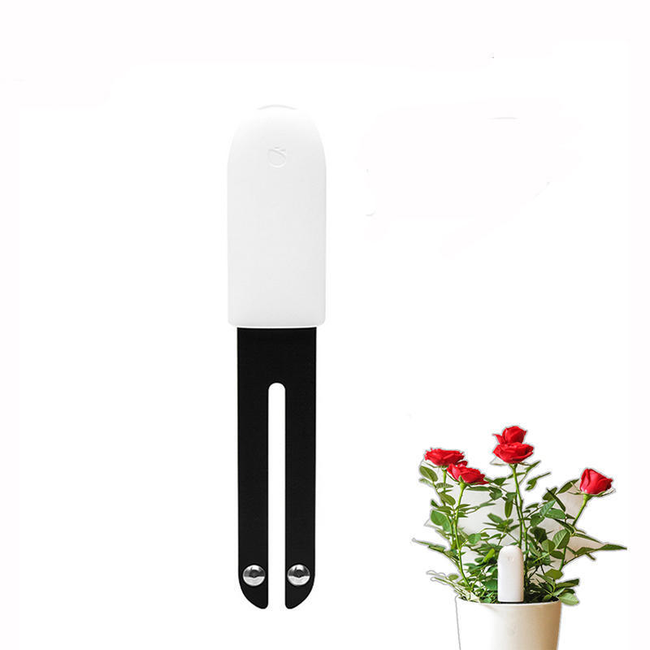
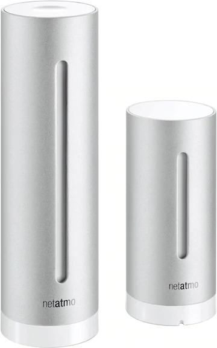

In my setup I use mostly Zigbee sensors because they're power-efficient and fairly cheap to purchase. Since they're not directly connected to the internet there's also less of an attack angle and you don't need to worry about privacy.

## Zigbee

These sensors communicate over the Zigbee protocol. Zigbee uses a 2.4GHz band that's similar to Wifi. It's main advantage is however that it forms a mesh network. So a tiny sensor running on a button cell doesn't have to connect at a central hub but rather uses the nearest mains powered device to repeat its signal. Since most of my lamps are also controlled over Zigbee I have a fairly extensive Zigbee mesh and these sensors never need to broadcast very far. In general the button cell of most of my sensors seems to last between 1-2years before needing to be replaced.

To connect the Zigbee mesh to Home Assistant I use a [Dresden Electronik ConBee](/hardware/networking/#dresden-elektronik-conbee-stick) USB stick and the [deCONZ](/software/home-assistant/#addons) Home Assistant addon.

### Aqara Door Sensor

{: align=left style="height:80px"}
This sensors consists of itself and a little magnet that's attached to a door or window. It sends a state update when it's opened or closed. I use these sensors to trigger automations when the apartment door is opened as well as for general state monitoring.

### Aqara Temperature & Humidity Sensor
{: align=left style="height:110px"}
This sensors reports various air quality metrics such as temperature, humidity and pressure. I have a ton of those placed in various spots around my apartment. Notable locations are inside the air ventilation system, fridge, bedroom and outside the window. They're so small that they can fit anywhere. I use these for air quality monitoring as well as to provide information to Google Home so I can ask it how warm it is.

### Aqara Motion Sensor
{: align=left style="height:100px"}
The motion sensors uses infrared to detect movement in a 170° field with a range of 7 meters. I use these to detect motion in the kitchen, bathroom, bedroom corridor and trigger relevant automations.. mostly turning on lights. E.g. after the alarm clock goes off in the morning there's a 15min window in which the corridor sensor will turn on lights in the bathroom and kitchen areas.

### Aqara Vibration Sensor
{: align=left style="height:70px"}
This sensor detects vibrations, tilt and drops. It can for example be used to detect when a chair is moved or a machine is started. It could also be used instead of a regular door sensor to detect when a door or window is opened. The downside of using it for this is that it doesn't know an opened or closed state, therefor it's really only useful if you want it alert you or trigger another kind of automation. In the past I've used it to turn on the lights when a chair was moved.

## Bluetooth Low Energy

### Xiaomi Flower Care
{: align=left style="height:140px"}
This sensor reports soil moisture, temperature, nutrition/fertilizer, temperature and light. It communicated over BLE and can be integrated directly in Home Assistant. However due to the limited range of BLE it can't reach my Home Assistant computer from my loggia where I keep most of my plants. Therefor I've set up a small Raspberry Pi Zero that collects the metrics from these sensors over BLE and then forwards them over MQTT (Wifi) to Home Assistant. A similar metrics collector could also be built with a ESP32 instead of a raspberry.
These sensors aren't super cheap, but they're a great way to quickly know what's wrong with a plant, e.g. low on fertilizer or too much water.

## Wifi

I also have a few wifi sensors. These sensors have the downside that you need to trust their respective manufacturer that they're secure and that their cloud services respect security and privacy standards. It's always advisable to use wifi devices that allow local access and don't require a cloud service to run.. sadly sometimes it's no possible to find such a product.

### Withings Sleep
This sensor is placed below the mattress and detects sleep cycles (deep, light, REM), heartbeats as well as snoring & sleeping disturbances. It has an Apple Health integration and reports it's metrics over Wifi. It does not offer any local access, all data is stored in the Withings Cloud and later downloaded to Apple Health.
Apart from it's use for health monitoring I use it to turn off all the lights when it detects that the bed is occupied.

{: style="height:150px"}

### Netatmo Weatherstation
This was one of the first devices I bought for my smart home. It consists of a indoor and outdoor weather station. Sadly the outdoor one has died after a few years.. but the indoor one is still going strong. Apart from the temperature it also reports the Carbon Dioxide levels which none of my other sensors do. This sensors also does not offer local access. All data is stored in the Netatmo cloud. It can be integrated into Home Assistant with cloud polling.

{: style="height:150px"}