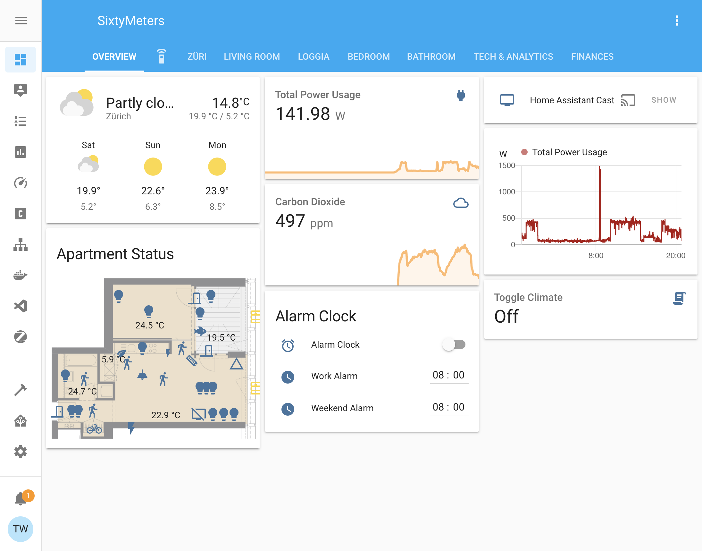
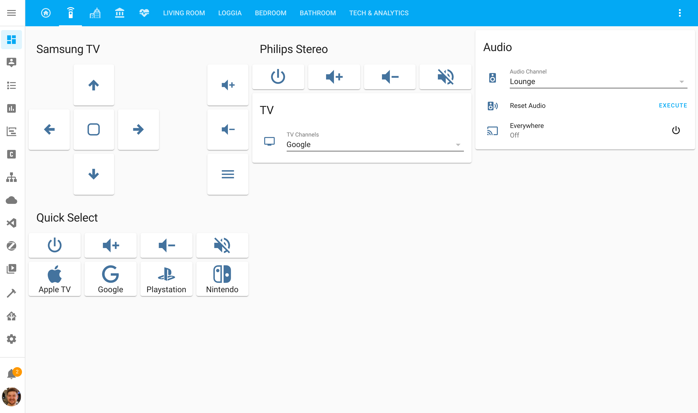
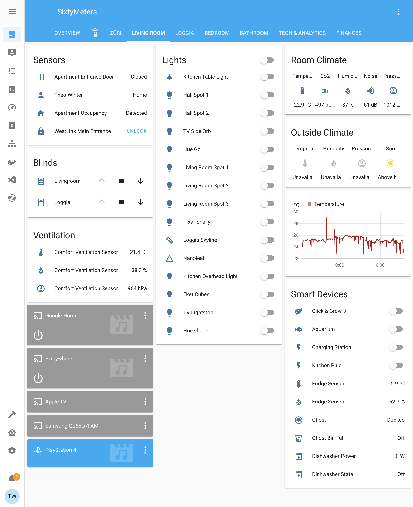
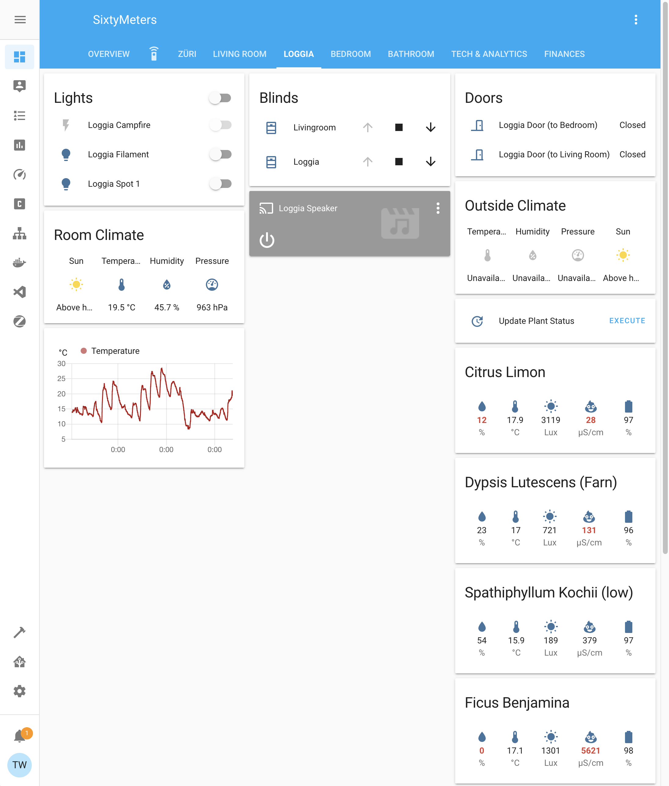
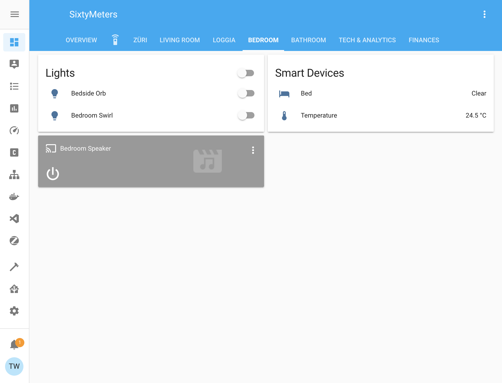
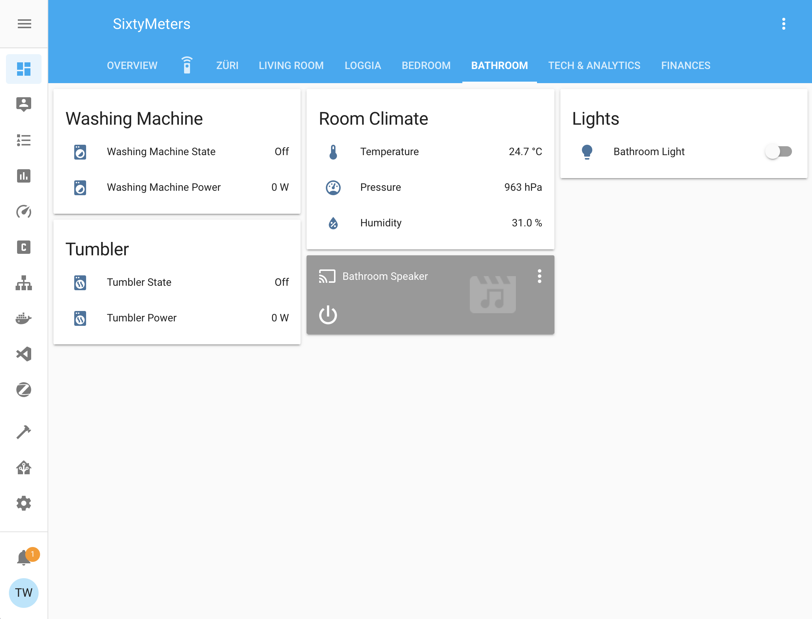
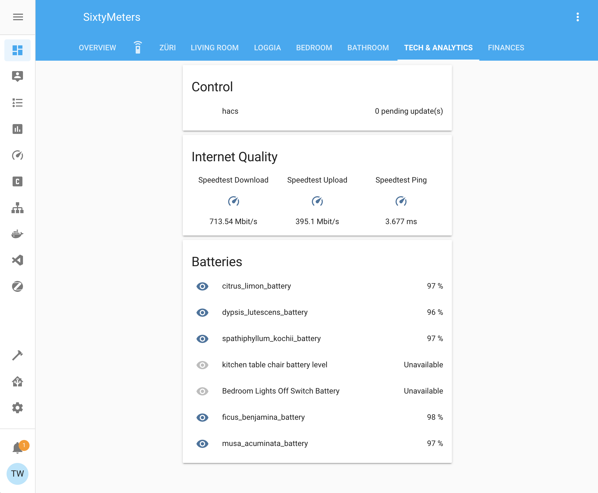

[Home Assistant](https://home-assistant.io/) is the brains of the whole operation. It controls all my smart devices and it provides a bit of an integration layer to connect everything to the Google Home and Apple Homekit ecosystems.

## Configuration
Home Assistant is configured over its UI and a set of .yaml configuration files. Most of my configuration is checked in [here](https://github.com/aerobless/home-assistant-configuration). The entry point of the configuration is the [configuration.yaml](https://github.com/aerobless/home-assistant-configuration/blob/master/configuration.yaml) file at the root of the repository. To keep the configuration easier to maintain and read I've split off several sub configurations. You can recognize those by the `!include example.yaml` instructions in the main configuration.yaml.

Passwords, auth tokens and other secrets are stored in a secrets.yaml file that is not checked in. You can recognize those by the `!secret id` instructions in the configuration.

## Screens

### Overview
This screen I use 90% of the time. Most devices are controllable from the mini map "Apartment Status". Lights and basic devices will just turn on/off when clicked, other devices such as the blinds open a modal window to change detailed settings.

### Media Remote Control
The remote control screen is meant to be used from the phone if I can't find the actual physical remote control ;-). It uses a logitech harmony IR blaster since most tv settings can't be reliably changed over their web apis. Back when I bought this TV it wasn't yet a requirement that it had to have a good api for automation :P.

### Züri Webcams
Some public webcams in various places around Zurich. I quite like this screen as it gives me a quick overview of what's happening in the city.

### Living Room
I rarely use the individual room screens, mostly just if a device is misbehaving.

### Loggia

### Bedroom

### Bathroom

### Tech & Analytics
This screen has been a bit neglected for a while. Ultimately it should display warnings if the battery of sensors goes below a certain threshold and other monitoring things like that.

## Addons
Home Assistant can be extended with addons. I'm currently using the following:

| Name                                                                                                | Description                                                                                                                        | Repo             |
|-----------------------------------------------------------------------------------------------------|------------------------------------------------------------------------------------------------------------------------------------|------------------|
| [AirCast](https://github.com/hassio-addons/addon-aircast)                                           | Creates virtual AirPlay devices for Chromecast devices                                                                             | Community Add-on |
| [Duck DNS](https://github.com/home-assistant/hassio-addons/tree/master/duckdns)                     | Automatically update your Duck DNS IP address with integrated HTTPS support via Let's Encrypt.                                     | Official Add-on  |
| [Glances](https://github.com/hassio-addons/addon-glances)                                           | Shows CPU, RAM etc. usage                                                                                                          | Community Add-on |
| [MariaDB](https://github.com/home-assistant/hassio-addons/tree/master/mariadb)                      | An SQL database server. Used as a replacement for the default SQLite DB.                                                           | Official Add-on  |
| [Mosquitto broker](https://github.com/home-assistant/hassio-addons/blob/master/mosquitto/README.md) | An Open Source MQTT broker. Used to connect to devices over MQTT.                                                                  | Official Add-on  |
| [Node-RED](https://github.com/hassio-addons/addon-node-red)                                         | Flow-based programming for the Internet of Things. Used for all sorts of automations                                               | Community Add-on |
| [Portainer](https://github.com/hassio-addons/addon-portainer)                                       | Portainer is an open-source lightweight management UI which allows you to easily manage a Docker host(s) or Docker swarm clusters. | Community Add-on |
| [Visual Studio Code](https://github.com/hassio-addons/addon-vscode)                                 | This add-on runs Visual Studio Code, allowing you to edit your Home Assistant configuration directly from your web browser.        | Community Add-on |
| [deCONZ](https://github.com/home-assistant/hassio-addons/tree/master/deconz)                        | Control a Zigbee network using ConBee or RaspBee hardware by Dresden Elektronik.                                                   | Official Add-on  |
| [Home Assistant Google Drive Backup](https://github.com/sabeechen/hassio-google-drive-backup)      | Creates regular backups of Home Assistant & Addons and uploads them to Google Drive. It uses the regular Home Assistant snapshot functionality and snapshots can be encrypted if you don't trust Google.                                                   | Third-Party Add-on  |
| [Influx](https://github.com/hassio-addons/addon-influxdb)      | A time-series database. I use it to store long-term data that I want to keep. E.g. various fitness metrics, account balances etc.                   | Community Add-on  |
| [Grafana](https://github.com/hassio-addons/addon-grafana)      | An analytics and visualization platform. I used it to visualize long-term data that I store in InfluxDB.                                                   | Community Add-on  |