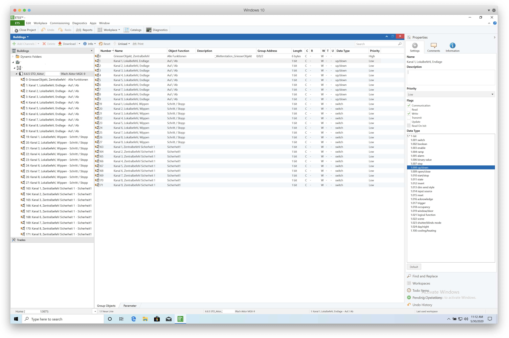
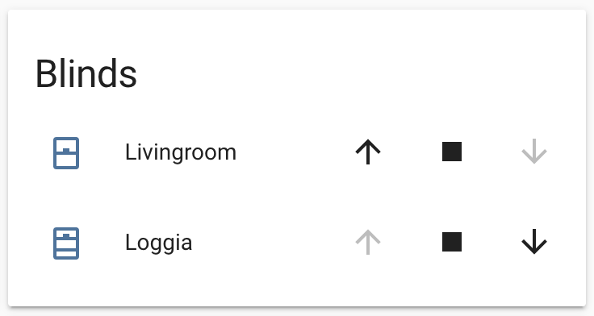
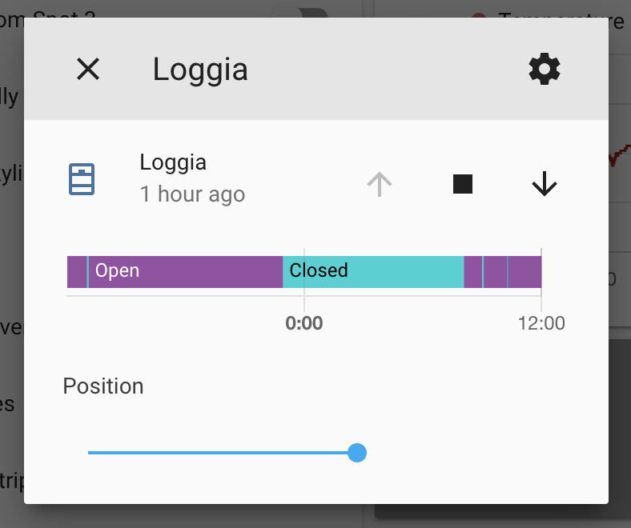

# KNX Blinds Configuration

The apartment that I'm renting has blinds that can be raised and lowered electronically. They're controlled over a "Griesser MGX-9 Motorsteuerung" (actor controller).
The controller communicates with the buildings central control unit over [KNX](https://en.wikipedia.org/wiki/KNX_(standard)). KNX is an open standard for building automation.

**Some of the rules that cause the building to control the blinds are:**

+ Direct sunlight on the side of the building at specific times (e.g. 8am, 9am) cause it to lower the blinds
+ Strong winds cause it to raise the blinds and lock them for some time (idk how long)
+ Manual central controls for maintenance, e.g. window cleaning, blinds maintenance etc.

I have no issue with the second and third rule, but I dislike it when the blinds are closed for sunlight reasons. My main problem is that I go to work early in the morning and the
building closes the blinds by 8am. This means that my plants are now in relative darkness until I get home at which point it might already by dark outside again.

But even when I'm home it's a bit annoying to have to get up and open the blinds again when the building decides it's time to lower them.

So here's my setup for controlling these blinds via Home Assistant:

## Communication

I use a KNX IP Interface 731 connected to the controller via KNX TP (twisted pair). The KNX IP interface has an ethernet socket and is plugged into my LAN. I've assigned it a fixed IPv4 IP.

## ETS5 Professional

Via the KNX IP Interface and a software called [ETS5 Professional](https://www.knx.org/knx-en/for-professionals/software/ets-5-professional/index.php) it's possible to overwrite the
configuration on the KNX controller. ETS5 can be downloaded for free as a demo version with full functionality for up to 5 projects. Since ETS5 is only released for Windows I've been using it on a Parallels VM.

!!! warning
    Beware, the existing configuration cannot be downloaded and changed. It's only possible to write an entirely new configuration onto the controller.
    
    The only way to keep the existing configuration is if you can get a hold of the configuration file from whoever set up the controller in the first place. If you're renting it can be a bit of a hassle to get the original configuration from a technician.



## KNX Configuration

So in order to control the blinds via Home Assistant what we need to do is assign group addresses. Over these address the blinds can then be controlled.

### Group Addresses

It's a good idea to invent some sort of system when assigning addresses so that it will be easier to remember which address does what when configuring them in Home Assistant.

!!! info
    A KNX group address has a data length of 16bit and consists of 3 parts: main/middle/sub

I've decided on the following scheme for my blinds: `prefix/blind/function`

#### Function addresses

| Function      | Value     | Length | Data Type           | Address |
|---------------|-----------|--------|---------------------|---------|
| Read Position | 0-255     | 1 byte | percentage (0-100%) | 233     |
| Step          | Step/Stop | 1 bit  | switch              | 232     |
| Set Position  | 0-255     | 1 byte | percentage (0-100%) | 231     |
| Up/Down       | Up/Down   | 1 bit  | up/down             | 230     |

#### Address list

| Function      | Blind       | Address  |
|---------------|-------------|----------|
| Read Position | Loggia      | 22/1/233 |
| Read Position | Living Room | 22/2/233 |
| Step          | Loggia      | 22/1/232 |
| Step          | Living Room | 22/2/232 |
| Set Position  | Loggia      | 22/1/231 |
| Set Position  | Living Room | 22/2/231 |
| Up/Down       | Loggia      | 22/1/230 |
| Up/Down       | Living Room | 22/1/230 |

In order to control multiple blinds at the same time you simply assign them the same address. E.g. for me the loggia and living room blinds consist of each 3 blinds. But since I don't want to control those individually I simply assign the three living room blinds the same address for each function.

### Home Assistant configuration

The setup within Home Assistant is fairly simple. First you have to configure the KNX IP interface as seen below:

```yaml
knx:
  tunneling:
    host: '192.168.178.71' # the IP of the KNX interface
    port: 3671
  fire_event: true
  fire_event_filter: ["22/1-2/*"] # Only listen to events from my blinds
```

!!! info
    Beware that the KNX IP interface may have a limit for how many computers it can be connected to at the same time.
    Mine only supports one computer, so I needed to disconnect ETS5 before restarting Home Assistant.

Then you have to setup the devices that should be controlled. For me these are my two blinds:

```yaml
cover:
  - platform: knx
    name: "Loggia"
    move_long_address: '22/1/230' # Up/Down function
    move_short_address: '22/1/232' # Step function
    position_address: '22/1/231' # Position function
    position_state_address: '22/1/233' # Read Position function
    travelling_time_down: 24
    travelling_time_up: 24
  - platform: knx
    name: "Livingroom"
    move_long_address: '22/2/230' # Up/Down function
    move_short_address: '22/2/232' # Step function
    position_address: '22/2/231' # Position function
    position_state_address: '22/2/233' # Read Position function
    travelling_time_down: 24
    travelling_time_up: 24
```

That's it, after a restart the blinds can be added to your lovelace UI.

{: style="height:150px"}

{: style="height:300px"}