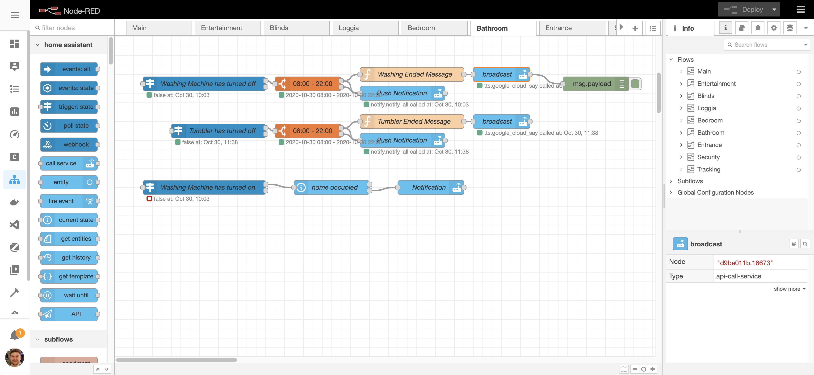

I use a [Home Assistant](/SmartHome/software/home-assistant/) addon called "Node-RED" for most of my automations. Node-RED is a low-code programming tool for wiring together hardware devices, APIs and online services. It was originally developed by IBM and is now part of the [OpenJS Foundation](https://nodered.org/). It can also be used standalone, e.g. without Home Assistant. But when used as a Home Assistant addon you automatically gain access to all devices, services etc. that are known to Home Assistant. This makes it really easy to wire together useful automations.

## Node-RED configuration
Node-RED is configured in it's UI. The resulting configuration is stored in a ["node-red" folder](https://github.com/aerobless/home-assistant-configuration/tree/master/node-red). Although it can be checked in it's not really meant to be human-readable or editable outside of Node-RED.

## Why use Node-RED over the Home Assistant built-in automation features?
These days pretty much everything that can be done in Node-RED could also be created as a native Home Assistant automation. However personally I still prefer Node-RED for the following reasons:

+ Easy debugging: with Node-RED you can simply attach a debug node and see exactly where the automations fails. Logs are immediately visible and can be restricted to the automation you're trying to debug.
+ Fast re-deployment: Re-deploying all automations is just a button click away and takes between 2-3seconds.
+ All automations and their components are visible at once and can easily be interconnected and copy&pasted for re-use.

The downside of using Node-RED is that the resulting configuration is not really human-readable and sharing automations is not exactly easy.