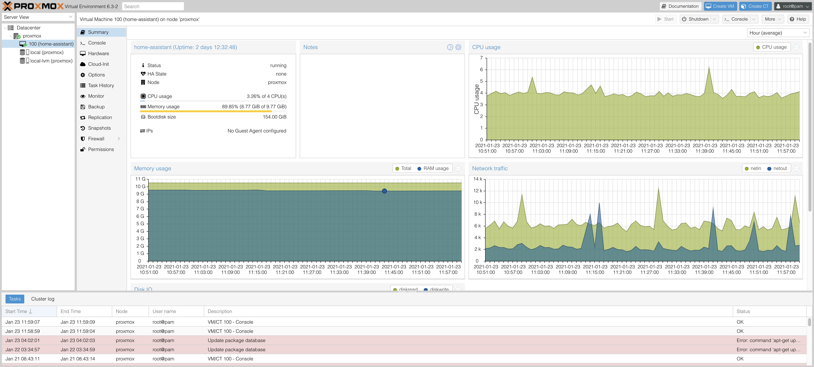

[Proxmox VE](https://www.proxmox.com/en/proxmox-ve) is an open-source server virtualization management platform. It allows the deployment and management of virtual machines & containers.

Proxmox is straight forward to install. And once installed it can be entirely configured over a web interface. You can see an example of my installation running below. My Proxmox VE installation is running on a [Intel NUC with 16GB Ram and an i3 dual core cpu](/hardware/computers/). So far performance has been great and I've not noticed any degradation versus running Home Assistant on bare metal.

## Migration

1. **Full Backup:** I previously had Home Assistant installed in supervised mode on a Ubuntu server OS. In order to migrate safely and have a surefire fallback solution I've purchased a new SSD to install Proxmox on. That way I could have easily reverted back to my old installation in case there would have been an issue with Proxmox. Alternatively I'd recommend making a full backup of your current installation before proceeding.

2. **Create a snapshot:** Next you'll want to create a snapshot of your home assistant instance. The snapshot is used to restore Home Assistant after it's been reinstalled inside of Proxmox. Beware that you should `shutdown all addons` before starting the snapshot creation. This is because sometimes creating a snapshot fails for the addon content if it's running. This actually happened to me and the snapshot didn't include the mariaDB addon. Now download the snapshot to your computer.

3. **Free up static IP:** I wanted Home Assistant to continue to be accessible under the same static ip address as before the Proxmox migration. This is especially necessary if you have devices, e.g. MQTT clients that are configured to reach HA under a specific IP address. Since Proxmox will use the IP address given to the computer it's running on we need to make sure that this address is different from the one we want to give the Home Assistant VM. Proxmox will generate a new MAC address for each of the VMs it is running. So I've logged into my routers static ip configuration page and assigned a new static ip to the computer that will run Proxmox. Now the original Home Assistant IP is free to be assigned to the virtual machine once we've installed everything.

## Installation
To install Proxmox I've followed this really [good tutorial by JuanMTech](https://www.youtube.com/watch?v=42gopfIrPBY) who's done pretty much the exact migration I wanted to do.

<iframe width="560" height="315" src="https://www.youtube.com/embed/42gopfIrPBY" frameborder="0" allow="accelerometer; autoplay; clipboard-write; encrypted-media; gyroscope; picture-in-picture" allowfullscreen></iframe>

I'm not going to write down all the steps from the tutorial in detail, just a rough outline and a few gotchas that weren't mentioned in the video.

1. Download the [Proxmox VE](https://www.proxmox.com/en/downloads/category/iso-images-pve) iso image
2. Flash the image to a usb drive with [balenaEtcher](https://www.balena.io/etcher/)
3. Perform the [migration steps](/software/proxmox/#migration) mentioned above if you haven't already.
4. Install Proxmox
    1. Use a static IP that's different from the one you want to use for Home Assistant
    2. I've used "proxmox.local" as FQDN
5. After the installation is complete Proxmox is accessible under `https://YOUR-PROXMOX-IP:8006`
6. Update Proxmox packages
7. Create a new VM 
6. Download the [Home Assistant OS QCOW2](https://www.home-assistant.io/hassio/installation/)
7. Upload the image to your Proxmox instance with a ftp client, e.g. [FileZilla](https://filezilla-project.org/)
    1. **Host:** your-proxmox-ip, **Username:** root, **Password:** your-password, **Port:** 22
8. Open the Shell of your Proxmox server and import the image `/root/hassos_VERSION.qcow2 local-lvm --format qcow2`
9. Assign imported disk to your Home Assistant VM
10. Resize the disk
11. This is not mentioned in the video but I had to add the disk to the boot order. This is done under Hardware > Boot Order. I've disabled everything except for the imported disk (scsi0).
12. Boot the VM, lookup it's MAC address and assign the desired static IP for Home Assistant in your router, then reboot the VM.
13. If you have usb devices that should be exposed to Home Assistant, e.g. a deCONZ ZigBee stick, add them (Hardware > Add USB Device)
14. Access Home Assistant and upload your snapshot to restore your configuration, data & addons
15. If you have network issues, e.g. accessing Nabu Casa Cloud doesn't work, this is likely due to a misconfigured IPv6 stack. [Nabu Casa recommends just turning off IPv6](https://www.nabucasa.com/config/troubleshooting/), which can be done by logging into Home Assistant via the shell and running `nmcli con modify "HassOS default" ipv6.method disabled`, then reboot.

## Troubleshooting

??? "The VM doesn't boot Home Assistant"
    See step 13. You likely need to set the correct boot order. So that the VM boots from the created disk.

??? "Can't access Home Assistant after restoring the snapshot"
    Are you using a SSL certificate? That was restored too, so now you need to access HA over https:// again. If you're using the DuckDns addon you should try accessing HA over that address now. If you're accessing HA from outside the LAN or over a domain name, make sure that the port-forwarding in your router is configured correctly.

??? "Unable to reach Home Assistant Cloud"
    See step 15 and look at [https://www.nabucasa.com/config/troubleshooting/](https://www.nabucasa.com/config/troubleshooting/).

??? "None of my devices are available"
    When HA has errors during startup it retries several times.. this makes the startup very slow and it takes a long time even for working devices and integrations to be started. Your best bet is to disable the stuff that doesn't work and fix them bit by bit. Be also sure the check if your main database is available. It may be that your snapshot didn't backup mariaDB or similar and now HA doesn't have a way to store states. Re-installing the required addon or switching back to file storage will help in this case.

## What else can I run on Proxmox

Here's a few ideas. I might expand on them at some point the future.

+ a PLEX mediaserver containing your favorite TV shows and films
+ a minecraft server for your kids (or yourself :P)
+ your own build server (e.g. Jenkins) if you're a developer
+ a VM of an OS that you sometimes need but aren't running on your main machine